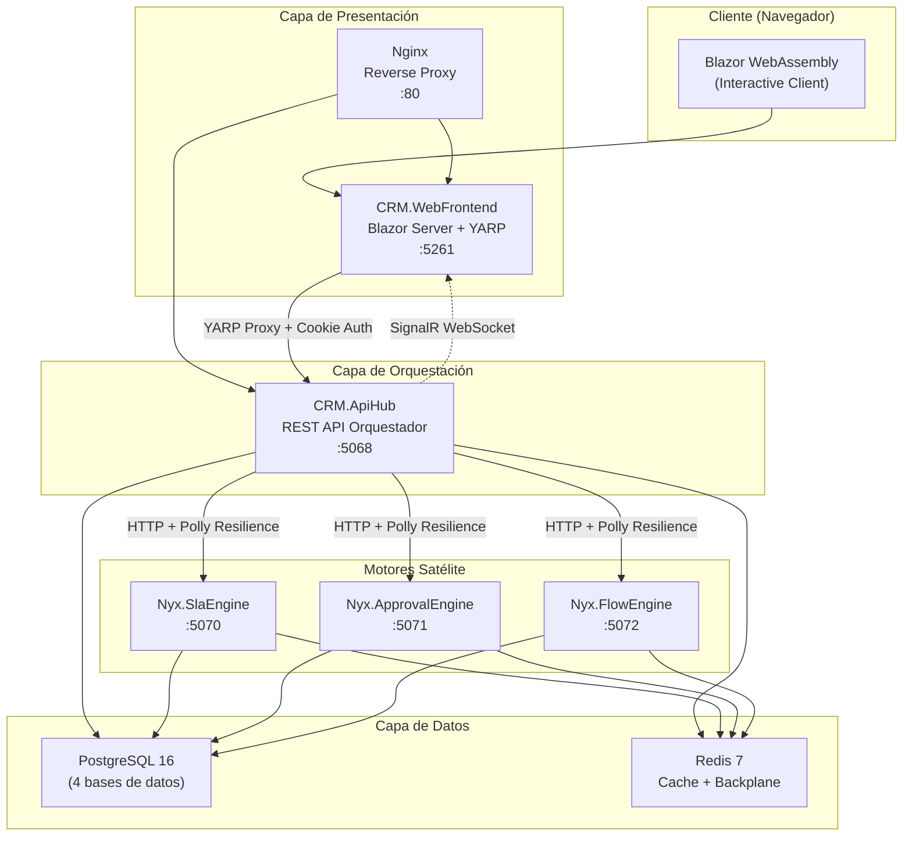
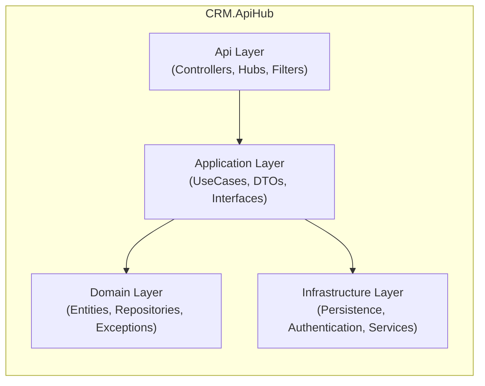
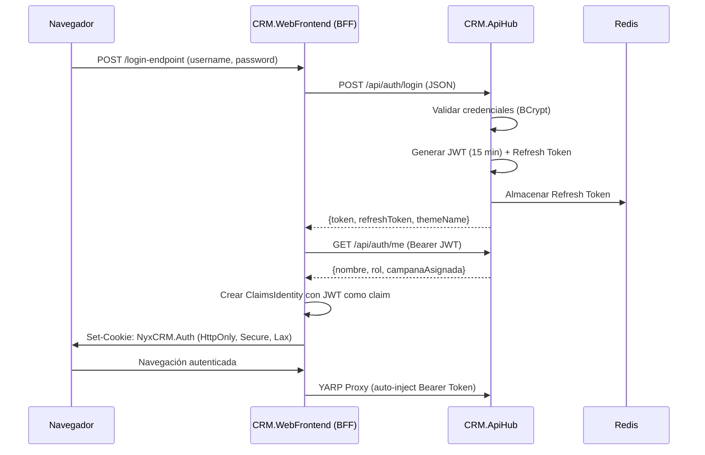
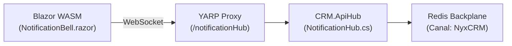
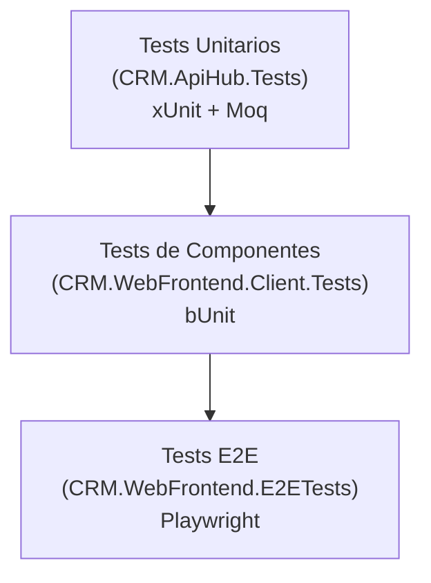
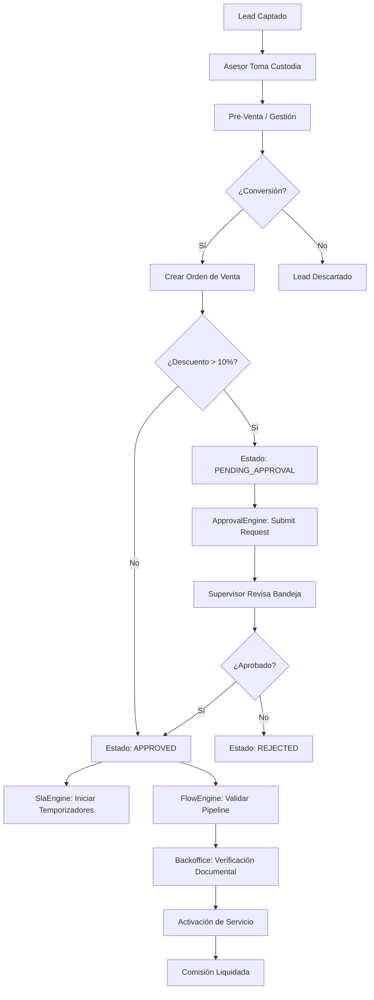
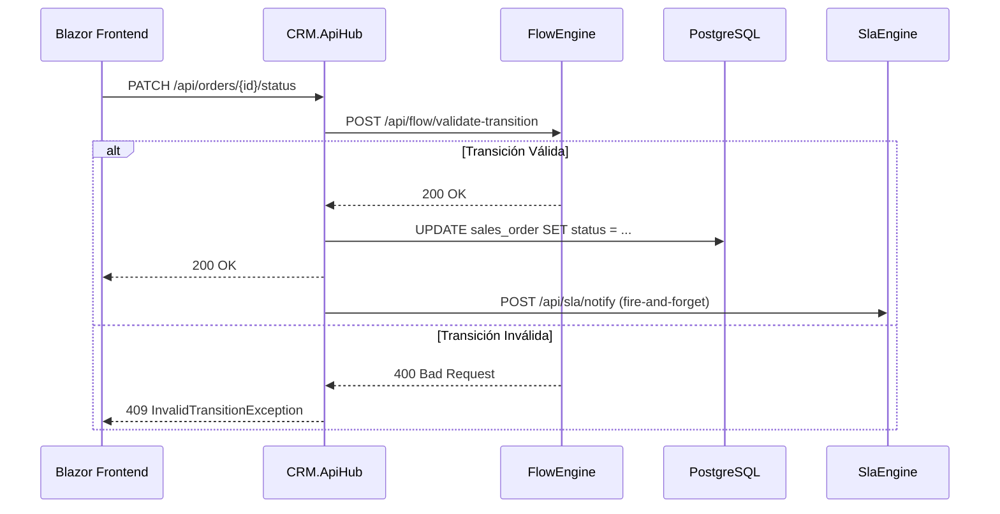

# 📋 Nyx CRM — Documento Técnico Completo del Ecosistema

> **Versión:** 1.0  
> **Fecha:** 2026-08-28  
> **Autor:** Tech Lead  
> **Repositorio:** `Nyx/`  

---

## Tabla de Contenidos

1. [¿Qué es Nyx CRM?](#1-qué-es-nyx-crm)
2. [Stack Tecnológico Completo](#2-stack-tecnológico-completo)
3. [Arquitectura del Sistema](#3-arquitectura-del-sistema)
4. [Estructura del Repositorio](#4-estructura-del-repositorio)
5. [Proyecto CRM.ApiHub (Orquestador Central)](#5-proyecto-crmapihub-orquestador-central)
6. [Proyecto CRM.WebFrontend (Servidor Blazor)](#6-proyecto-crmwebfrontend-servidor-blazor)
7. [Proyecto CRM.WebFrontend.Client (Blazor WebAssembly)](#7-proyecto-crmwebfrontendclient-blazor-webassembly)
8. [Motores Satélite Nyx](#8-motores-satélite-nyx)
9. [Base de Datos y Persistencia](#9-base-de-datos-y-persistencia)
10. [Autenticación y Seguridad](#10-autenticación-y-seguridad)
11. [Comunicación en Tiempo Real (SignalR)](#11-comunicación-en-tiempo-real-signalr)
12. [Resiliencia y Tolerancia a Fallos](#12-resiliencia-y-tolerancia-a-fallos)
13. [Infraestructura Docker](#13-infraestructura-docker)
14. [Reverse Proxy y Networking](#14-reverse-proxy-y-networking)
15. [Logging y Observabilidad](#15-logging-y-observabilidad)
16. [Pipeline CI/CD](#16-pipeline-cicd)
17. [Estrategia de Testing](#17-estrategia-de-testing)
18. [Módulos Funcionales de Negocio](#18-módulos-funcionales-de-negocio)
19. [Flujos de Negocio Clave](#19-flujos-de-negocio-clave)
20. [Documentación del Proyecto](#20-documentación-del-proyecto)

---

## 1. ¿Qué es Nyx CRM?

**Nyx CRM** es un sistema de gestión de relaciones con clientes (CRM) diseñado para operaciones de Call Center. Construido sobre una arquitectura de **microservicios orquestados**, gestiona el ciclo de vida completo de un Lead desde su captación hasta la conversión en Orden de Venta, pasando por procesos de pre-venta, auditoría de calidad, activación de servicios, comisiones y aprobaciones.

El sistema está diseñado para tres roles principales:
- **Asesor**: Operador de Call Center que gestiona leads, pre-ventas y órdenes.
- **Supervisor**: Gestiona equipos, aprueba descuentos, transfiere custodia, genera reportes.
- **Backoffice/Admin**: Administra catálogos, estados, usuarios, auditoría y configuración del sistema.

---

## 2. Stack Tecnológico Completo

### Framework y Runtime

| Tecnología | Versión | Uso |
|---|---|---|
| **.NET** | 10.0 | Framework principal para todos los proyectos |
| **ASP.NET Core** | 10.0 | Backend REST API y hosting del frontend |
| **Blazor** | Interactive Server + WebAssembly | Frontend web interactivo con renderizado híbrido |
| **C#** | 13 (implícito en .NET 10) | Lenguaje de programación principal |

### Acceso a Datos

| Tecnología | Versión | Uso |
|---|---|---|
| **Dapper** | 2.1.35 | Micro-ORM para acceso directo a PostgreSQL con SQL puro |
| **Npgsql** | 10.0.3 / 9.0.2 | Driver ADO.NET nativo para PostgreSQL |
| **PostgreSQL** | 16 Alpine | Base de datos relacional principal |
| **Redis** | 7 Alpine | Cache distribuido, almacén de Refresh Tokens y backplane de SignalR |
| **StackExchange.Redis** | 2.8.16 | Cliente .NET para Redis |

### Autenticación y Seguridad

| Tecnología | Versión | Uso |
|---|---|---|
| **JWT Bearer Authentication** | 10.0.9 | Autenticación stateless del ApiHub |
| **System.IdentityModel.Tokens.Jwt** | 8.0.2 / 8.19.1 | Generación y validación de tokens JWT |
| **Microsoft.IdentityModel.JsonWebTokens** | 8.0.2 | Manejo de JWT en formato JSON |
| **BCrypt.Net-Next** | 4.0.3 | Hashing seguro de contraseñas |
| **Cookie Authentication** | Nativo ASP.NET | Autenticación del frontend Blazor Server |
| **Data Protection API** | Nativo .NET | Protección de claves y cifrado de datos sensibles |
| **AES-256 Encryption** | Custom (`EncryptionHelper.cs`) | Cifrado de connection strings en reposo |

### Comunicación en Tiempo Real

| Tecnología | Versión | Uso |
|---|---|---|
| **ASP.NET Core SignalR** | 10.0.10 | WebSockets para notificaciones push en tiempo real |
| **SignalR.Client** | 10.0.10 | Cliente SignalR para Blazor WASM |
| **SignalR.StackExchangeRedis** | 10.0.10 | Backplane Redis para SignalR en clúster |

### Resiliencia y HTTP

| Tecnología | Versión | Uso |
|---|---|---|
| **Microsoft.Extensions.Http.Resilience** | 10.9.0 | Polly v8 integrado: Circuit Breaker, Retry, Timeout |
| **Microsoft.Extensions.Http.Polly** | 10.0.9 | Políticas de resiliencia HTTP en el frontend |
| **Polly** | (transitivo) | Patrones de resiliencia (Retry, Circuit Breaker, Bulkhead) |

### Reverse Proxy

| Tecnología | Versión | Uso |
|---|---|---|
| **YARP (Yet Another Reverse Proxy)** | 2.3.0 | Proxy inverso in-process en el frontend Blazor Server |
| **Nginx** | 1.27 Alpine | Reverse proxy de producción para todos los servicios |

### UI y Frontend

| Tecnología | Versión | Uso |
|---|---|---|
| **MudBlazor** | 9.6.0 | Biblioteca de componentes Material Design para Blazor |
| **Markdig** | 1.3.2 | Parser de Markdown para la Base de Conocimiento (KB) |
| **Bootstrap Icons** | (CDN) | Iconografía del sistema |
| **CSS Custom Properties** | Vanilla CSS | Sistema de theming dinámico ("Galaxy Theme") |

### Logging y Observabilidad

| Tecnología | Versión | Uso |
|---|---|---|
| **Serilog.AspNetCore** | 10.0.0 | Framework de logging estructurado |
| **Serilog.Sinks.File** | 7.0.0 | Escritura de logs a archivos |
| **Serilog.Formatting.Compact** | 3.0.0 | Formato JSON compacto para logs |
| **Serilog.Enrichers.Environment** | 3.0.1 | Enriquecimiento de logs con datos de entorno |
| **Serilog.Enrichers.Thread** | 4.0.0 | Enriquecimiento de logs con ID de hilo |

### Documentación API

| Tecnología | Versión | Uso |
|---|---|---|
| **Swashbuckle.AspNetCore** | 10.2.3 | Generación automática de Swagger/OpenAPI |
| **Microsoft.AspNetCore.OpenApi** | 10.0.8/9 | Soporte nativo de OpenAPI |

### Contenedorización y DevOps

| Tecnología | Versión | Uso |
|---|---|---|
| **Docker** | Multi-stage builds | Contenedorización de todos los servicios |
| **Docker Compose** | 3.8 | Orquestación local de contenedores |
| **GitHub Actions** | CI Pipeline | Integración continua |
| **SonarQube** | Via GitHub Actions | Análisis estático de código |
| **OWASP Dependency-Check** | Via GitHub Actions | Escaneo de vulnerabilidades en dependencias |

### Testing

| Tecnología | Versión | Uso |
|---|---|---|
| **xUnit** | 2.9.3 | Framework de pruebas unitarias |
| **Moq** | 4.20.72 | Framework de mocking para pruebas unitarias |
| **bUnit** | (en Client.Tests) | Pruebas de componentes Blazor |
| **Playwright for .NET** | (en E2ETests) | Pruebas End-to-End de navegador |
| **Coverlet** | 6.0.4 | Recolección de cobertura de código |

---

## 3. Arquitectura del Sistema

### Patrón: Orquestador Central con Motores Satélite



### Principios Arquitectónicos

- **Clean Architecture por capas**: Cada proyecto sigue `Domain → Application → Infrastructure → Api/Presentation`.
- **Patrón Use Case**: Toda lógica de negocio se encapsula en Use Cases inyectables (`CreateSalesOrderUseCase`, `UpdateLeadStatusUseCase`, etc.).
- **Repository Pattern**: Interfaces en `Domain/Repositories/` con implementaciones Dapper en `Infrastructure/Persistence/`.
- **Dependency Injection**: Toda la configuración de DI se centraliza en `DependencyInjection.cs`.
- **Separación Frontend/Backend**: El frontend Blazor nunca accede directamente a la base de datos; todo pasa por la API REST del ApiHub.

---

## 4. Estructura del Repositorio

```text
Nyx/
├── CRM.ApiHub/                      # 🔵 Orquestador Central (REST API)
│   ├── Api/
│   │   ├── Controllers/             # 24 controladores REST
│   │   ├── Extensions/              # Extension methods
│   │   ├── Filters/                 # RequiresPermissionAttribute (RBAC)
│   │   ├── Hubs/                    # NotificationHub.cs (SignalR)
│   │   └── Middlewares/             # Middleware pipeline
│   ├── Application/
│   │   ├── DTOs/                    # 20+ Data Transfer Objects
│   │   ├── Interfaces/              # IJwtTokenGenerator, INotificationService, IRefreshTokenStore
│   │   ├── Services/                # NotificationService (SignalR push)
│   │   └── UseCases/                # 12 módulos de casos de uso
│   │       ├── Activations/         # Gestión de activaciones de servicio
│   │       ├── Audit/               # Auditoría de calidad (checklists)
│   │       ├── Auth/                # Login, Me, RefreshToken
│   │       ├── Backoffice/          # Gestión de custodia back-office
│   │       ├── Commissions/         # Liquidación de comisiones
│   │       ├── Documents/           # Upload y verificación documental
│   │       ├── KB/                  # Base de conocimiento (búsqueda, feedback)
│   │       ├── Leads/               # CRUD y gestión de leads
│   │       ├── Providers/           # Integración con proveedores externos
│   │       ├── Reports/             # Reportes y funnel de conversión
│   │       ├── SalesOrders/         # CRUD de órdenes de venta
│   │       └── Supervisor/          # Gestión de equipos y transferencia masiva
│   ├── Domain/
│   │   ├── DTOs/                    # DTOs de dominio (Approval, AlternateProfile)
│   │   ├── Entities/                # 41 entidades de dominio
│   │   ├── Exceptions/              # InvalidTransitionException (custom)
│   │   ├── Repositories/            # 24 interfaces de repositorio
│   │   └── Utils/                   # StringSanitizer
│   ├── Infrastructure/
│   │   ├── Authentication/          # JWT Generator, Redis Token Store, CustomUserIdProvider
│   │   ├── Persistence/             # 26 repositorios Dapper + EncryptionHelper + DbConnectionFactory
│   │   ├── Services/                # Clientes HTTP: FlowEngineClient, SlaEngineClient, ApprovalEngineClient
│   │   └── DependencyInjection.cs   # Composición root de DI
│   ├── Dockerfile
│   └── Program.cs                   # Bootstrap: Serilog, CORS, Rate Limiting, Swagger, SignalR
│
├── CRM.WebFrontend/                 # 🟢 Servidor Blazor (Server-Side Rendering)
│   ├── Components/Pages/            # 14 páginas server-rendered
│   │   ├── Engines/                 # 6 páginas de gestión de motores Nyx
│   │   ├── Dashboard.razor          # Dashboard principal del sistema
│   │   ├── Login.razor              # Página de login con formulario POST
│   │   ├── AsesorDashboard.razor    # Dashboard del asesor
│   │   ├── AsesorOrderDetail.razor  # Detalle de orden (60KB de UI)
│   │   ├── AudioAudit.razor         # Auditoría de calidad de audio
│   │   ├── Incidents.razor          # Gestión de incidencias
│   │   ├── SupervisorReports.razor  # Reportes del supervisor
│   │   └── ...
│   ├── Providers/                   # PersistingServerAuthenticationStateProvider
│   ├── Services/                    # 11 servicios server-side (Backoffice, Reports, etc.)
│   ├── ServerAuthHandler.cs         # DelegatingHandler para inyectar JWT automáticamente
│   ├── Dockerfile
│   └── Program.cs                   # Bootstrap: Cookie Auth, YARP, MudBlazor
│
├── CRM.WebFrontend.Client/          # 🟡 Blazor WebAssembly (Client-Side)
│   ├── Components/
│   │   ├── UI/                      # Componentes reutilizables: LoadingSkeletonTable, EmptyState, ApiErrorBanner
│   │   └── NotificationBell.razor   # Campana de notificaciones (SignalR)
│   ├── Helpers/                     # ValidationHelper
│   ├── Layout/
│   │   ├── MainLayout.razor         # Layout principal con sidebar
│   │   ├── NavMenu.razor            # Menú de navegación con RBAC visual
│   │   └── ReconnectModal.razor     # Modal de reconexión automática
│   ├── Models/                      # DTOs del cliente (Leads, Notifications, Maintenance, etc.)
│   ├── Pages/
│   │   ├── AdminPages/              # 12 páginas de administración
│   │   ├── Asesor/                  # 5 páginas del asesor (LeadTray, Orders, PreSales, etc.)
│   │   ├── KB/                      # 2 páginas de base de conocimiento
│   │   ├── Supervisor/              # 4 páginas del supervisor (Dashboard, Approvals, BulkTransfer)
│   │   ├── ApprovalInbox.razor      # Bandeja de aprobaciones
│   │   └── UserProfileConfig.razor  # Configuración de perfil de usuario
│   ├── Providers/                   # PersistentAuthenticationStateProvider (WASM)
│   ├── Services/                    # 14 servicios cliente (Lead, Approval, Commission, KB, etc.)
│   └── Program.cs                   # Bootstrap WASM: HttpClient, servicios, AuthState
│
├── Nyx.SlaEngine/                   # ⏱️ Motor SLA (Service Level Agreement)
│   ├── Application/                 # Lógica de negocio SLA
│   ├── Controllers/                 # Endpoints REST del motor SLA
│   ├── Domain/                      # Entidades SLA (TimerEvent, SlaPolicy, etc.)
│   ├── Infrastructure/              # Repositorios Dapper del motor SLA
│   ├── Dockerfile
│   └── Program.cs
│
├── Nyx.ApprovalEngine/              # ✅ Motor de Aprobaciones
│   ├── Application/                 # ApprovalService
│   ├── Controllers/                 # ApprovalControllers.cs (submit, decide, pending)
│   ├── Domain/                      # Entidades de aprobación
│   ├── Infrastructure/              # ApprovalRepository (Dapper)
│   ├── Dockerfile
│   └── Program.cs
│
├── Nyx.FlowEngine/                  # 🔀 Motor de Flujos de Estado
│   ├── Application/                 # Lógica de validación de transiciones
│   ├── Controllers/                 # Endpoints REST de validación
│   ├── Domain/                      # Entidades de flujo (Pipeline, Stage, Transition)
│   ├── Infrastructure/              # Repositorios Dapper del motor de flujos
│   ├── Dockerfile
│   └── Program.cs
│
├── tests/                           # 🧪 Suite de Pruebas
│   ├── CRM.ApiHub.Tests/            # Pruebas unitarias (xUnit + Moq)
│   ├── CRM.WebFrontend.Client.Tests/# Pruebas de componentes (bUnit)
│   └── CRM.WebFrontend.E2ETests/    # Pruebas E2E (Playwright)
│
├── db_export/                       # 📦 Scripts de Base de Datos
│   ├── 01_init_databases.sh         # Inicialización multi-base de datos
│   ├── 02_update_roles_substatuses.sql
│   ├── 03_fix_passwords.sql
│   ├── 04_init_sla_schema.sql       # Schema del SlaEngine
│   ├── 05_init_approval_schema.sql  # Schema del ApprovalEngine
│   ├── 06_init_flow_schema.sql      # Schema del FlowEngine
│   ├── nyx_crm_backup.sql           # Backup de la base principal
│   ├── nx_ecosystem_backup.sql      # Backup del ecosistema
│   └── nyx_flow_backup.sql          # Backup del motor de flujos
│
├── docs/                            # 📚 Documentación ISO (19 carpetas temáticas)
├── nginx/                           # Configuración de Nginx para producción
├── scripts/                         # Scripts de utilidad
├── storage/                         # Almacenamiento de documentos subidos
├── .github/workflows/ci.yml         # Pipeline CI/CD (GitHub Actions)
├── docker-compose.yml               # Orquestación local (6 servicios)
├── docker-compose.prod.yml          # Orquestación producción (7 servicios + Nginx)
├── CRM.sln                          # Solución .NET (9 proyectos)
└── swagger.json                     # Especificación OpenAPI exportada (401KB)
```

---

## 5. Proyecto CRM.ApiHub (Orquestador Central)

### Función
Es el **corazón del ecosistema**. Actúa como gateway único que expone la API REST, orquesta los motores satélite y mantiene la base de datos principal.

### Capas Internas



### Controladores (24 endpoints REST)

| Controlador | Responsabilidad |
|---|---|
| `AuthController` | Login, `/me`, Refresh Token |
| `LeadController` | CRUD de leads, cambio de estado |
| `SalesOrderController` | CRUD de órdenes de venta, timeline |
| `CampaignController` | Gestión de campañas |
| `DocumentController` | Upload/download de documentos |
| `SupervisorController` | Estadísticas de equipo, órdenes del equipo |
| `BackofficeController` | Órdenes asignadas, verificación documental |
| `ApprovalController` | Bandeja de aprobaciones, decisión |
| `AuditController` | Checklists de auditoría de calidad |
| `CommissionController` | Liquidación y gestión de comisiones |
| `IncidentController` | Gestión de incidencias |
| `KBController` | Base de conocimiento (búsqueda, artículos) |
| `FormController` | Formularios dinámicos |
| `ActivationController` | Tracking de activaciones de servicio |
| `ProviderController` | Sincronización con proveedores |
| `ReportController` | Funnel de conversión, estadísticas |
| `MaintenanceController` | Operaciones de mantenimiento masivo |
| `NotificationController` | Gestión de alertas y notificaciones |
| `HealthController` | Health checks del ecosistema |
| `EngineManagementController` | Administración de los motores Nyx |
| `PortfolioController` | Gestión de portafolio |
| `PreSaleController` | Pre-ventas |
| `UserPreferencesController` | Preferencias de usuario (tema, etc.) |
| `AlternateProfileController` | Perfiles alternos |

### Entidades de Dominio (41 entidades)

Las entidades principales incluyen:
- **Lead**: Prospecto de venta con estado, campaña y asesor asignado.
- **SalesOrder**: Orden de venta con estado, substatus, historial y custodia.
- **Campaign**: Campaña comercial que agrupa leads y órdenes.
- **User / UserDetail**: Usuarios del sistema con roles y preferencias.
- **OrderDocument**: Documentos adjuntos a órdenes (contratos, INE, etc.).
- **OrderIncident**: Incidencias asociadas a órdenes.
- **OrderStatus / OrderSubstatus**: Catálogos de estados y subestados.
- **CommissionSettlement**: Liquidaciones de comisiones a asesores.
- **KbArticle**: Artículos de la base de conocimiento.
- **FormTemplate / FormField**: Formularios dinámicos configurables.
- **ProductActivationTracking**: Seguimiento de activación de servicios.
- **SalesOrderAudit / AuditChecklistTemplate**: Auditoría de calidad.
- **ProviderCatalog / ProviderSyncLog**: Integración con proveedores.

### Casos de Uso (12 módulos, 40+ use cases)

Cada módulo encapsula su lógica de negocio en clases inyectables:

| Módulo | Use Cases |
|---|---|
| **Auth** | `LoginUseCase`, `MeUseCase`, `RefreshTokenUseCase` |
| **Leads** | `GetLeadsUseCase`, `GetLeadByIdUseCase`, `CreateLeadUseCase`, `UpdateLeadStatusUseCase` |
| **SalesOrders** | `GetSalesOrdersUseCase`, `GetSalesOrderByIdUseCase`, `CreateSalesOrderUseCase`, `UpdateSalesOrderStatusUseCase`, `GetSalesOrderHistoryUseCase` |
| **Documents** | `GetDocumentsByOrderUseCase`, `GetDocumentByIdUseCase`, `UploadOrderDocumentUseCase`, `VerifyOrderDocumentUseCase` |
| **Supervisor** | `GetTeamOrdersUseCase`, `GetTeamStatsUseCase`, `BulkTransferToBackofficeUseCase` |
| **Backoffice** | `GetAssignedOrdersUseCase`, `GetPendingVerificationUseCase`, `UpdateBackofficeOrderStatusUseCase`, `VerifyBackofficeDocumentUseCase` |
| **Audit** | `GetChecklistUseCase`, `CreateAuditUseCase`, `SaveAuditItemUseCase`, `CloseAuditUseCase` |
| **KB** | `SearchKbArticlesUseCase`, `GetKbArticleByIdUseCase`, `SubmitKbFeedbackUseCase` |
| **Commissions** | `GetCurrenciesUseCase`, `ConvertAmountUseCase`, `GetSettlementsUseCase`, `CreateSettlementUseCase`, `AddSettlementItemsUseCase`, `UpdateSettlementStatusUseCase`, `DeleteSettlementUseCase` |
| **Providers** | `GetProviderCatalogUseCase`, `GetProviderStatusMappingUseCase`, `LogProviderSyncUseCase`, `UpdateOrderProviderStatusUseCase` |
| **Activations** | `GetPendingActivationsUseCase`, `GetActivationsByOrderUseCase`, `UpdateActivationUseCase`, `GetDelayedActivationsUseCase` |
| **Reports** | `GetConversionFunnelUseCase`, `GetSalesByAsesorUseCase`, `GetIncidentStatsUseCase`, `GetActivationStatsUseCase` |

---

## 6. Proyecto CRM.WebFrontend (Servidor Blazor)

### Función
Actúa como **Backend-for-Frontend (BFF)**. Sirve las páginas Blazor Server, maneja la autenticación por cookies, y proxea las llamadas API al ApiHub mediante YARP.

### Responsabilidades Clave

1. **Autenticación por Cookies**: El endpoint `/login-endpoint` (Minimal API) recibe credenciales, las valida contra el ApiHub (`POST /api/auth/login`), obtiene un JWT, lo almacena como claim en una cookie HTTP-only y establece la sesión.
2. **YARP Reverse Proxy**: Todas las llamadas del cliente a `/api/*` son proxyeadas automáticamente al ApiHub, inyectando el Bearer Token desde las cookies del usuario.
3. **Server-Side Rendering**: Las páginas más pesadas (Dashboard, CheckpointsHub, AsesorOrderDetail) se renderizan en el servidor para mejor rendimiento.
4. **Persistencia de AuthState**: El `PersistingServerAuthenticationStateProvider` serializa los claims del usuario y los pasa al componente WASM para mantener el estado de autenticación sincronizado.

### Páginas Server-Rendered

| Página | Descripción |
|---|---|
| `Login.razor` | Formulario de login con theming dinámico |
| `Dashboard.razor` | Dashboard ejecutivo del sistema completo |
| `AsesorDashboard.razor` | Dashboard personalizado del asesor (67KB) |
| `AsesorOrderDetail.razor` | Ficha detallada de una orden (60KB) |
| `AudioAudit.razor` | Auditoría de calidad de llamadas (49KB) |
| `Incidents.razor` | Gestión de incidencias |
| `SupervisorReports.razor` | Reportes analíticos del supervisor |
| `BackofficeActivations.razor` | Seguimiento de activaciones |
| `KbAdmin.razor` | Administración de la base de conocimiento |
| `CheckpointsHub.razor` | Panel maestro de motores Nyx (169KB — la página más grande) |

---

## 7. Proyecto CRM.WebFrontend.Client (Blazor WebAssembly)

### Función
Componentes interactivos que se ejecutan en el **navegador del usuario** (WebAssembly). Manejan la interactividad de las vistas del Asesor, Supervisor y Admin.

### Componentes Reutilizables

| Componente | Descripción |
|---|---|
| `LoadingSkeletonTable` | Esqueleto de carga animado para tablas |
| `EmptyState` | Estado vacío con icono, título y CTA |
| `ApiErrorBanner` | Banner de error con botón de reintento |
| `AdvisorOnboardingBanner` | Banner de bienvenida para nuevos asesores |
| `NotificationBell` | Campana de notificaciones con SignalR en tiempo real |
| `ReconnectModal` | Modal de reconexión automática con JavaScript |

### Páginas del Asesor

| Página | Ruta | Descripción |
|---|---|---|
| `LeadTray.razor` | `/asesor/leads` | Bolsa de trabajo con leads disponibles (Virtualize) |
| `Orders.razor` | `/asesor/orders` | Bandeja de órdenes en custodia con filtros y paginación |
| `NewOrder.razor` | `/asesor/orders/new` | Formulario de creación de orden de venta |
| `PreSales.razor` | `/asesor/presales` | Gestión de pre-ventas |
| `Comisiones.razor` | `/asesor/comisiones` | Visualización de comisiones del asesor |

### Páginas del Supervisor

| Página | Ruta | Descripción |
|---|---|---|
| `SupervisorDashboard.razor` | `/supervisor` | Dashboard del supervisor (111KB — segunda página más grande) |
| `SupervisorOrderDetail.razor` | `/supervisor/order/{id}` | Detalle de orden con acciones de supervisión |
| `SupervisorApprovals.razor` | `/supervisor/approvals` | Bandeja de aprobaciones pendientes (Virtualize) |
| `BulkTransfer.razor` | `/supervisor/bulk-transfer` | Transferencia masiva de custodia a backoffice |

### Páginas de Administración (12 páginas)

| Página | Descripción |
|---|---|
| `AdminDashboard.razor` | Panel de administración general |
| `AdminUsuarios.razor` | Gestión de usuarios del sistema |
| `AdminRoles.razor` | Gestión de roles y permisos |
| `AdminEstados.razor` | Gestión de catálogo de estados/subestados (76KB) |
| `AdminCatalogo.razor` | Catálogo general de productos y servicios |
| `AdminComisiones.razor` | Configuración de reglas de comisiones |
| `AdminFichas.razor` | Gestión de fichas y formularios |
| `AdminAuditoriaCalidad.razor` | Configuración de auditoría |
| `AdminBaseConocimiento.razor` | Gestión de artículos KB |
| `AdminCustodiaLog.razor` | Log de cambios de custodia |
| `AdminSystemLogs.razor` | Visualización de logs del sistema |
| `Maintenance.razor` | Operaciones de mantenimiento masivo |

### Servicios del Cliente

| Servicio | Responsabilidad |
|---|---|
| `ILeadService` / `LeadService` | Comunicación con endpoints de leads |
| `IApprovalService` / `ApprovalService` | Bandeja de aprobaciones |
| `IMaintenanceService` / `MaintenanceService` | Operaciones de mantenimiento |
| `IActivationService` / `ActivationService` | Seguimiento de activaciones |
| `ICommissionService` / `CommissionService` | Gestión de comisiones |
| `IKbService` / `KbService` | Base de conocimiento |
| `NotificationService` | Conexión SignalR para notificaciones push |

---

## 8. Motores Satélite Nyx

Los motores satélite son **microservicios independientes** que encapsulan lógica de dominio especializada. Cada uno tiene su propia base de datos PostgreSQL y sigue Clean Architecture.

### Nyx.SlaEngine (Puerto 5070)

**Función**: Gestiona los Acuerdos de Nivel de Servicio (SLA). Controla temporizadores y plazos asociados a las órdenes de venta.

- **Interacción**: El ApiHub lo invoca de forma **fire-and-forget controlado** (non-blocking) después de cambios de estado exitosos.
- **Base de datos**: `nyx_sla` (schema propio en PostgreSQL).
- **Stack**: .NET 10 + Dapper + Npgsql.
- **Resiliencia**: Si el motor está caído, el Circuit Breaker del ApiHub aísla la falla y la loggea sin afectar la transacción principal.

### Nyx.ApprovalEngine (Puerto 5071)

**Función**: Motor de aprobaciones para transacciones que requieren autorización (ej. descuentos mayores al 10%).

- **Endpoints**: `POST /api/approval/requests/submit`, `GET /api/approval/requests/pending`, `POST /api/approval/requests/{id}/decide`.
- **Regla de negocio**: Segregación de Funciones (SoD) — el creador de la solicitud no puede ser el aprobador.
- **Base de datos**: `nyx_approval` (schema propio).
- **Stack**: .NET 10 + Dapper + Npgsql.

### Nyx.FlowEngine (Puerto 5072)

**Función**: Motor de flujos de estado que valida transiciones entre estados de las órdenes.

- **Interacción**: El ApiHub lo consulta **antes** de ejecutar un cambio de estado para verificar si la transición es válida.
- **Concepto**: Define Pipelines (ej. `PIPELINE_TELECOM`, `PIPELINE_ALARMAS`), cada uno con Stages y Transitions permitidas.
- **Base de datos**: `nyx_flow` (schema propio).
- **Stack**: .NET 10 + Dapper + Npgsql.
- **Excepción personalizada**: Si la transición no es válida, el ApiHub lanza `InvalidTransitionException`.

---

## 9. Base de Datos y Persistencia

### Motor: PostgreSQL 16 (Alpine)

El ecosistema utiliza **4 bases de datos aisladas** en una sola instancia PostgreSQL:

| Base de Datos | Propietario | Uso |
|---|---|---|
| `nyx_crm` | `ronald` | Base principal del CRM (órdenes, leads, usuarios, campañas, etc.) |
| `nx_ecosystem` | `ronald` | Datos del ecosistema general |
| `nyx_sla` | `usr_sla` | Datos exclusivos del SlaEngine |
| `nyx_approval` | `usr_approval` | Datos exclusivos del ApprovalEngine |
| `nyx_flow` | `usr_flow` | Datos exclusivos del FlowEngine |

### ORM: Dapper (Micro-ORM)

- Se usa **SQL puro** en todos los repositorios, sin abstracción pesada de ORM.
- Configuración global: `Dapper.DefaultTypeMap.MatchNamesWithUnderscores = true` para mapear automáticamente `snake_case` (PostgreSQL) a `PascalCase` (C#).
- Los connection strings se cifran en reposo con AES-256 (`EncryptionHelper.cs`).

### Inicialización

Los scripts en `db_export/` se ejecutan automáticamente cuando PostgreSQL arranca por primera vez mediante el volumen montado en `/docker-entrypoint-initdb.d`:

1. `01_init_databases.sh` — Crea las bases de datos y usuarios.
2. `02_update_roles_substatuses.sql` — Catálogos iniciales.
3. `04_init_sla_schema.sql` — Schema del SlaEngine.
4. `05_init_approval_schema.sql` — Schema del ApprovalEngine.
5. `06_init_flow_schema.sql` — Schema del FlowEngine.
6. `nyx_crm_backup.sql` / `nx_ecosystem_backup.sql` — Datos de arranque.

### Redis 7 (Alpine)

Redis cumple tres funciones:

| Función | Implementación |
|---|---|
| **Almacén de Refresh Tokens** | `RedisRefreshTokenStore.cs` — TTL configurable por token |
| **Backplane de SignalR** | Canal `NyxCRM` para sincronizar notificaciones entre instancias |
| **Cache distribuido** | Disponible para cacheo de catálogos y datos frecuentes |

---

## 10. Autenticación y Seguridad

### Flujo de Autenticación Completo



### Capas de Seguridad

| Capa | Implementación |
|---|---|
| **Capa 1: Autenticación** | JWT Bearer (ApiHub) + Cookie Auth (Frontend) |
| **Capa 2: Autorización RBAC** | `[Authorize(Roles = "SUPERVISOR,BACKOFFICE")]` en controladores y páginas Blazor |
| **Capa 3: Permisos Granulares** | `RequiresPermissionAttribute` — Verifica permisos contra función PostgreSQL `fn_can_user_action()` |
| **Capa 4: Data Protection** | `DataProtection API` con scope de aplicación `NyxCRM` |
| **Capa 5: Rate Limiting** | Fixed Window: 30 req/min (Login), 100 req/min (API) |
| **Capa 6: CORS** | Orígenes permitidos configurables |
| **Capa 7: Headers de Seguridad (Nginx)** | HSTS, CSP, X-Frame-Options DENY, X-Content-Type-Options nosniff, X-XSS-Protection |
| **Capa 8: Docker Security** | Imágenes Alpine, usuario `appuser` no-root |
| **Capa 9: Cifrado en Reposo** | AES-256 para connection strings (`EncryptionHelper.cs`) |
| **Capa 10: Password Hashing** | BCrypt con salt automático |

### JWT Claims

```json
{
  "id_user": "123",
  "username": "jdoe",
  "name": "John Doe",
  "role": "ASESOR",
  "access_token": "<jwt>",
  "refresh_token": "<token>",
  "campaign": "TELECOM_2026",
  "theme_name": "theme-galaxy"
}
```

---

## 11. Comunicación en Tiempo Real (SignalR)

### Arquitectura



### Implementación

- **Hub**: `NotificationHub.cs` — Autorizado (`[Authorize]`), agrupa conexiones por `user-{userId}`.
- **CustomUserIdProvider**: Extrae el ID del usuario del JWT para rutear mensajes individuales.
- **Backplane Redis**: Permite escalar horizontalmente el ApiHub sin perder mensajes de SignalR.
- **Cliente**: `NotificationBell.razor` establece conexión SignalR desde el navegador, escucha eventos y muestra notificaciones en la UI con badge de conteo.
- **Nginx**: Configuración especial de WebSocket con `proxy_read_timeout 3600s` para mantener conexiones persistentes.

---

## 12. Resiliencia y Tolerancia a Fallos

### Microsoft.Extensions.Http.Resilience (Polly v8)

Los 3 clientes HTTP de motores satélite están protegidos con `AddStandardResilienceHandler()`:

```csharp
services.AddHttpClient<ISlaEngineClient, SlaEngineClient>(client => {
    client.BaseAddress = new Uri("http://sla_engine_api:5070");
    client.Timeout = TimeSpan.FromSeconds(5);
}).AddStandardResilienceHandler();
```

Esto aplica automáticamente:

| Patrón | Comportamiento |
|---|---|
| **Retry** | Reintento exponencial con jitter (hasta 3 intentos) |
| **Circuit Breaker** | Abre el circuito tras fallos consecutivos, aísla el motor |
| **Timeout** | 5 segundos por request, 30s total por intento |
| **Rate Limiter** | Previene sobrecarga del motor destino |

### Estrategia por Motor

| Motor | Comportamiento ante falla |
|---|---|
| **FlowEngine** | **Bloqueante**: Si falla, se aborta la transición de estado. `InvalidTransitionException`. |
| **SlaEngine** | **Non-blocking**: Se ejecuta fire-and-forget. Si falla, se loggea pero NO revierte la transacción principal. |
| **ApprovalEngine** | **Bloqueante**: Si falla al crear la solicitud de aprobación, la orden queda en estado inconsistente (se aborta). |

---

## 13. Infraestructura Docker

### docker-compose.yml (Desarrollo Local)

6 servicios con health checks y dependencias:

```text
┌─────────────────────────────────────────────┐
│             Docker Compose Local            │
│                                             │
│  ┌─────────┐  ┌───────────┐  ┌───────────┐ │
│  │ Redis   │  │ PostgreSQL│  │ ApiHub    │ │
│  │ :6379   │  │ :5432     │  │ :5068     │ │
│  └────┬────┘  └─────┬─────┘  └─────┬─────┘ │
│       │             │              │        │
│  ┌────┴────┐  ┌─────┴─────┐  ┌────┴──────┐ │
│  │ SLA     │  │ Approval  │  │ Flow      │ │
│  │ :5070   │  │ :5071     │  │ :5072     │ │
│  └─────────┘  └───────────┘  └───────────┘ │
│                                             │
│       ┌─────────────────────┐               │
│       │   WebFrontend       │               │
│       │   :5261             │               │
│       └─────────────────────┘               │
└─────────────────────────────────────────────┘
```

### docker-compose.prod.yml (Producción)

7 servicios — Agrega **Nginx** como gateway y cambia puertos `expose` (internos):

- Los servicios backend no exponen puertos al host.
- Nginx (`:80`) es el único punto de entrada.
- Volúmenes persistentes para PostgreSQL y Redis.
- Variables de entorno externalizadas vía `.env`.

### Dockerfiles (Multi-stage Build)

Todos los Dockerfiles siguen el mismo patrón seguro:

1. **Stage 1 (Build)**: SDK .NET 10, `dotnet restore`, `dotnet publish Release`.
2. **Stage 2 (Runtime)**: ASP.NET Runtime Alpine, usuario no-root (`appuser`).

---

## 14. Reverse Proxy y Networking

### YARP (In-Process, Frontend)

El frontend Blazor Server usa YARP para proxear llamadas al ApiHub:

```json
{
  "ReverseProxy": {
    "Routes": {
      "apiRoute": { "ClusterId": "apiCluster", "Match": { "Path": "/api/{**catch-all}" } },
      "hubRoute": { "ClusterId": "apiCluster", "Match": { "Path": "/notificationHub/{**catch-all}" } }
    },
    "Clusters": {
      "apiCluster": { "Destinations": { "destination1": { "Address": "http://crm_apihub:5068" } } }
    }
  }
}
```

Una **Request Transform** inyecta automáticamente el Bearer Token del JWT almacenado en la cookie:

```csharp
builderContext.AddRequestTransform(transformContext => {
    var tokenClaim = httpContext.User.FindFirst("access_token");
    if (tokenClaim != null) {
        transformContext.ProxyRequest.Headers.Authorization = 
            new AuthenticationHeaderValue("Bearer", tokenClaim.Value);
    }
});
```

### Nginx (Producción)

Nginx enruta el tráfico según la URL:

| Ruta | Destino |
|---|---|
| `/` | `crm_webfrontend:5261` (Blazor) |
| `/api/` | `crm_apihub:5068` (REST API) |
| `/swagger/` | `crm_apihub:5068` (Docs) |
| `/notificationHub` | `crm_apihub:5068` (SignalR WebSocket) |
| `/sla/` | `sla_engine_api:5070` |
| `/approval/` | `approval_engine_api:5071` |
| `/flow/` | `flow_engine_api:5072` |

---

## 15. Logging y Observabilidad

### Serilog (Logging Estructurado)

Configurado en el ApiHub con los siguientes sinks y enriquecedores:

```json
{
  "Serilog": {
    "MinimumLevel": { "Default": "Information", "Override": { "Microsoft": "Warning" } },
    "WriteTo": [{ "Name": "Console" }],
    "Enrich": ["FromLogContext"]
  }
}
```

**Paquetes de enriquecimiento**:
- `Serilog.Enrichers.Environment` — Agrega nombre de máquina y sistema operativo.
- `Serilog.Enrichers.Thread` — Agrega el ID del hilo.
- `Serilog.Formatting.Compact` — Formato JSON compacto para consumo por herramientas externas.
- `Serilog.Sinks.File` — Escritura a archivos rotativos.

Actualmente los logs se escriben a **consola Docker** (stdout), lo que permite integrarlos con cualquier stack de observabilidad externo (ELK, Grafana Loki, Seq, etc.).

---

## 16. Pipeline CI/CD

### GitHub Actions (`ci.yml`)

```yaml
name: CI Pipeline
on:
  push: [main, develop]
  pull_request: [main, develop]

jobs:
  build_and_scan:
    steps:
      - Checkout repository
      - Setup .NET 10
      - Setup JDK 17 (para SonarQube)
      - OWASP Dependency-Check (escaneo de vulnerabilidades)
      - Begin SonarQube Scan (análisis estático)
      - dotnet restore CRM.sln
      - dotnet build CRM.sln --no-restore -c Release
      - dotnet test CRM.sln (ejecuta xUnit, bUnit, E2E)
      - End SonarQube Scan
```

**Herramientas integradas**:

| Herramienta | Propósito |
|---|---|
| **SonarQube** | Análisis estático de código, deuda técnica, code smells |
| **OWASP Dependency-Check** | Detección de CVEs en dependencias NuGet |
| **dotnet test** | Ejecución de toda la suite de pruebas |

---

## 17. Estrategia de Testing

### 3 niveles de pruebas:



| Proyecto | Framework | Cobertura |
|---|---|---|
| `CRM.ApiHub.Tests` | xUnit 2.9.3 + Moq 4.20.72 | Use Cases (`CreateSalesOrderUseCase`, `UpdateLeadStatusUseCase`, etc.) |
| `CRM.WebFrontend.Client.Tests` | bUnit | Componentes Blazor (`LeadTray`, etc.) |
| `CRM.WebFrontend.E2ETests` | Playwright for .NET | Flujos completos de navegador contra Docker local (`LeadTrayE2ETests`) |

**Credenciales E2E**: Inyectadas mediante variables de entorno (`TEST_USER_EMAIL`, `TEST_USER_PASSWORD`), nunca hardcodeadas.

---

## 18. Módulos Funcionales de Negocio

### Módulo de Leads
- Captación de prospectos con datos demográficos.
- Asignación automática a campañas.
- Transiciones de estado validadas por el FlowEngine.
- Bolsa de trabajo con `<Virtualize>` para rendimiento.

### Módulo de Órdenes de Venta (Sales Orders)
- Creación de órdenes desde leads convertidos.
- Regla de negocio: `DiscountPercentage > 10%` → estado `PENDING_APPROVAL`.
- Historial de estados (timeline) con trazabilidad completa.
- Custodia jerárquica: Asesor → Supervisor → Backoffice.

### Módulo de Aprobaciones
- Motor `Nyx.ApprovalEngine` para decisiones de autorización.
- Bandeja del Supervisor con acciones Aprobar/Rechazar.
- Segregación de Funciones (SoD): el creador no puede aprobar.

### Módulo de Pre-Ventas
- Gestión de pre-ventas antes de la conversión a orden.
- Formularios dinámicos con validación.

### Módulo de Documentos
- Upload de documentos adjuntos a órdenes (contratos, INE, comprobantes).
- Verificación documental por Backoffice.
- Almacenamiento en disco (`Storage/Documents`).

### Módulo de Auditoría de Calidad
- Checklists configurables por template.
- Auditoría de llamadas de audio.
- Calificación y cierre de auditorías.

### Módulo de Comisiones
- Liquidación de comisiones por asesor.
- Conversión de moneda (multi-currency).
- Items de liquidación con estados.

### Módulo de Incidencias
- Registro y seguimiento de incidencias por orden.
- Catálogo de tipos de incidencia.

### Módulo de Base de Conocimiento (KB)
- Artículos con contenido Markdown (renderizado con Markdig).
- Búsqueda de artículos.
- Feedback de utilidad por usuario.
- Portal de consulta para asesores.

### Módulo de Activaciones
- Tracking de activación de servicios vendidos.
- Detección de activaciones retrasadas.
- Actualización de estado de activación.

### Módulo de Proveedores
- Catálogo de proveedores externos.
- Mapeo de estados proveedor ↔ estados internos.
- Log de sincronización con proveedores.

### Módulo de Reportes
- Funnel de conversión (leads → ventas).
- Ventas por asesor.
- Estadísticas de incidencias.
- Estadísticas de activaciones.

### Módulo de Mantenimiento
- Operaciones masivas sobre catálogos.
- Gestión de estados, subestados, campañas, productos.
- Administración de formularios dinámicos.

---

## 19. Flujos de Negocio Clave

### Flujo: Lead → Orden de Venta → Aprobación



### Flujo: Cambio de Estado con Orquestación



---

## 20. Documentación del Proyecto

El directorio `docs/` contiene **19 carpetas temáticas** organizadas por estándar ISO:

| Carpeta | Contenido |
|---|---|
| `00-overview/` | Visión general del proyecto |
| `01-architecture/` | Diagramas de arquitectura |
| `02-modules/` | Documentación por módulo (Leads, Orders) |
| `02-requirements/` | Requisitos funcionales y no funcionales |
| `03-api/` | Documentación de API REST |
| `03-flows/` | Diagramas de flujos de negocio |
| `04-database/` | Esquemas y modelos de datos |
| `05-integrations/` | Integraciones con motores satélite |
| `06-infrastructure/` | Docker, Nginx, despliegue |
| `07-operations/` | Guías operativas |
| `08-user-guides/` | Guías de usuario por rol |
| `09-visual-docs/` | Documentación visual (capturas) |
| `10-knowledge-base/` | Contenido de la base de conocimiento |
| `11-incidents/` | Gestión de incidencias |
| `12-security/` | Hardening y seguridad |
| `13-testing/` | Estrategia y reportes de testing |
| `14-changelog/` | Registro de cambios |
| `99-reference/` | Material de referencia |

Además incluye documentos sueltos como:
- `API_Documentation.md` (52KB de documentación de API).
- `Deploy.md` (guía de despliegue).
- `hardening_seguridad_api_dayan.md` (hardening de seguridad).
- `optimizacion_base_datos_dayan.md` (optimización PostgreSQL).
- `resiliencia_tolerancia_fallos_fdw_dayan.md` (tolerancia a fallos con FDW).
- Colección de Postman para testing manual.
- Script `db_smoke_test.sql` para validación de datos.

---

> **Resumen**: Nyx CRM es un ecosistema empresarial de **9 proyectos .NET 10** distribuidos en **7 contenedores Docker**, con arquitectura de microservicios orquestada, **40+ entidades de dominio**, **24 controladores REST**, **40+ use cases**, comunicación en tiempo real por **SignalR**, resiliencia con **Polly/Circuit Breaker**, autenticación **JWT + Cookies**, base de datos **PostgreSQL con 5 schemas**, cache **Redis**, reverse proxy **YARP + Nginx**, CI/CD con **GitHub Actions + SonarQube + OWASP**, y testing en 3 niveles (**xUnit + bUnit + Playwright**).
