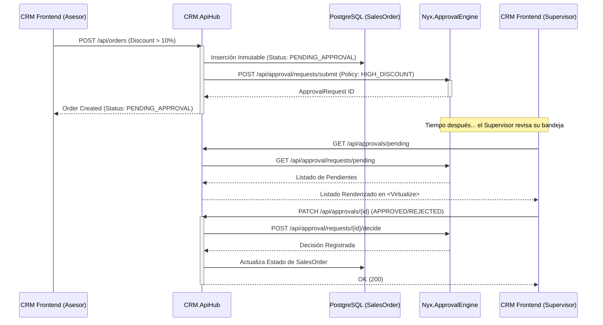

# ISO Header
Código: FLW-APP-001
Versión: 1.0
Fecha: 2026-08-28
Autor: Tech Lead

# Flujo de Aprobación de Órdenes

## Diagrama del Flujo

## Consideraciones
- **Transaccionalidad**: La orden se inserta inmutablemente en la base de datos principal, sin importar si el motor de aprobación está tardando en responder. El cliente de integración (`ApprovalEngineClient`) maneja los reintentos vía `Polly`.
- **Segregación de Deberes (SoD)**: El motor `Nyx.ApprovalEngine` valida internamente que el creador de la solicitud no pueda ser el mismo que toma la decisión, garantizando el cumplimiento normativo.
- **Rendimiento UI**: La interfaz de Supervisor (`SupervisorApprovals.razor`) emplea `<Virtualize>` para mantener la fluidez en el cliente independientemente de la cantidad de aprobaciones en cola.
