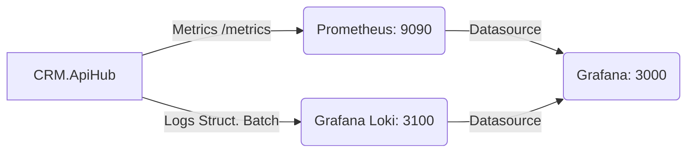

# Monitoreo y Observabilidad (ISO 25010)

El ecosistema Nyx CRM está instrumentado para proporcionar telemetría completa (logs, métricas y dashboards) utilizando el stack abierto: Prometheus, Loki y Grafana. Esta arquitectura cumple con los requerimientos de la ISO 25010 en materia de Confiabilidad y Mantenibilidad.

## Topología de Observabilidad



### 1. Centralización de Logs (Loki + Serilog)
La aplicación utiliza `Serilog.Sinks.Grafana.Loki` para hacer push de todos los logs estructurados directamente al contenedor Loki.
- **Modo de envío**: Por lotes (Batch) y completamente **asíncrono/no bloqueante**.
- **Ventaja**: Si Loki experimenta lentitud o una caída, el orquestador (`CRM.ApiHub`) no se bloqueará ni penalizará el tiempo de respuesta de las peticiones.
- **Acceso Local**: `http://localhost:3100`

### 2. Recolección de Métricas (Prometheus)
`CRM.ApiHub` expone el endpoint estándar `/metrics` mediante el paquete `prometheus-net.AspNetCore`.
- **Funcionamiento**: Prometheus ejecuta un *scrape* (raspado) sobre el endpoint `/metrics` cada 15 segundos (`infrastructure/prometheus.yml`).
- **Métricas expuestas**: Tiempos de respuesta HTTP, uso de CPU, recolección de memoria (GC), tamaño de thread pool y métricas custom si fuesen implementadas.
- **Acceso Local**: `http://localhost:9090`

### 3. Visualización (Grafana)
Grafana actúa como la interfaz unificada (single pane of glass) combinando los datos de Prometheus y Loki.
- **Acceso Local**: `http://localhost:3000`
- **Autenticación Base**: `admin` / `admin` (GF_SECURITY_ADMIN_PASSWORD configurado en docker-compose).

## Despliegue Local
La infraestructura de monitoreo se arranca junto al stack con:
```bash
docker-compose up -d
```
Las configuraciones maestras de los demonios se encuentran en la carpeta `/infrastructure`.
