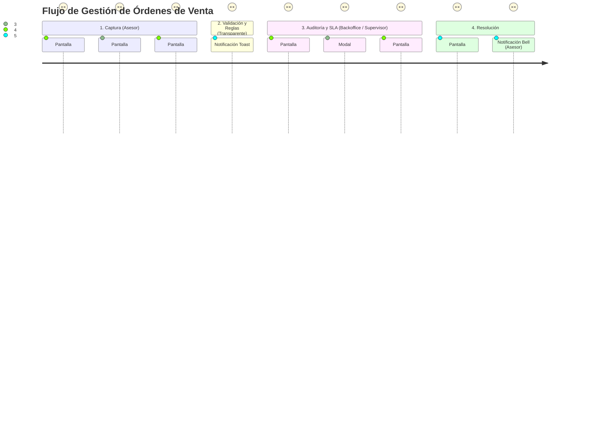

# ISO Header
Código: VUF-002
Versión: 1.0
Fecha: 2026-08-27
Autor: Tech Lead

# Visual User Flow: Flujo Principal B2B Call Center

```mermaid
journey
    title Flujo de Gestión de Órdenes de Venta
    section 1. Captura (Asesor)
      Pantalla: Nuevo Lead / Llamada: 4: Asesor
      Pantalla: Formulario de Orden de Venta: 3: Asesor
      Pantalla: Subida de Documentos Requeridos: 4: Asesor
    section 2. Validación y Reglas (Transparente)
      Notificación Toast: "Orden Enviada a Backoffice": 5: Sistema
    section 3. Auditoría y SLA (Backoffice / Supervisor)
      Pantalla: Bandeja de Pendientes (Backoffice): 4: Backoffice
      Modal: Vista Previa de Contratos: 3: Backoffice
      Pantalla: Dashboard SLA (Supervisor): 4: Supervisor
    section 4. Resolución
      Pantalla: Detalle de Orden (Aprobada/Rechazada): 5: Backoffice
      Notificación Bell (Asesor): "Orden Procesada": 5: Sistema
```
