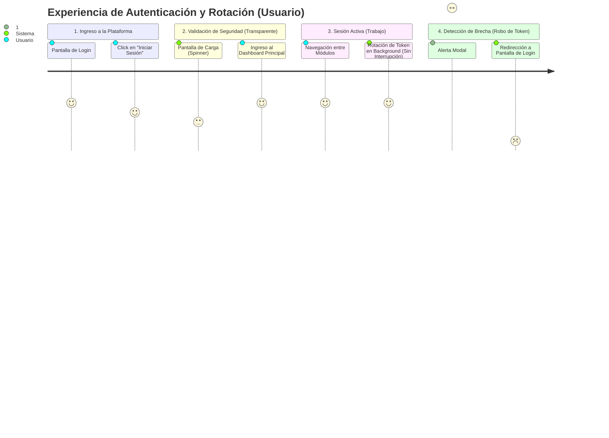

# ISO Header
Código: VUF-001
Versión: 1.0
Fecha: 2026-08-27
Autor: Tech Lead

# Visual User Flow: Login & Token Renewal

*Nota: Este diagrama representa pantallas y estados de experiencia del usuario, no decisiones lógicas de backend.*

