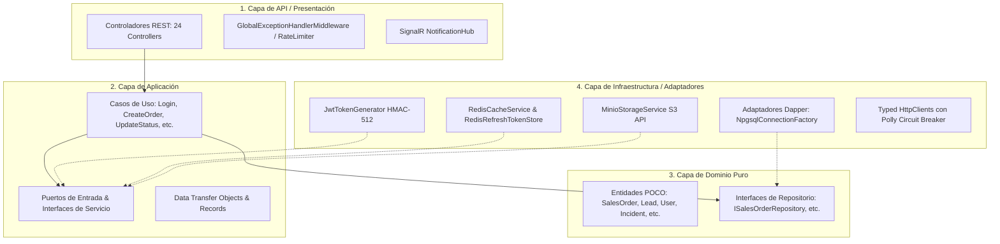

# 🏛️ Arquitectura de la API Central Robusta — CRM.ApiHub

> **Especificación Técnica, Patrones de Diseño, Resiliencia y Seguridad**  
> **Runtime**: .NET 10.0 | **Framework**: ASP.NET Core Web API | **Persistencia**: Dapper + PostgreSQL 16  
> **Caché y Mensajería**: Redis 7 | **Almacenamiento de Objetos**: MinIO S3 | **Telemetría**: OpenTelemetry & Serilog  

---

## 1. 📐 Principios de Diseño y Arquitectura Hexagonal (Clean Architecture)

El backend de **Nyx CRM** está estructurado siguiendo los principios de la **Arquitectura Hexagonal (Ports & Adapters)** y diseño guiado por el dominio (DDD), garantizando que las reglas de negocio permanezcan completamente desacopladas de frameworks, bases de datos o servicios externos.



---

## 2. 🛡️ Capa de Seguridad y Autenticación de Grado Bancario

### 2.1. Tokens JWT con Firmado Criptográfico Robusto
- **Algoritmo**: `HmacSha512` con clave secreta robusta de 584 bits configurada en variables de entorno.
- **Claims Estándar**: `sub` (User ID), `name` (Username), `role` (Rol asignado: ASESOR, SUPERVISOR, BACKOFFICE, ADMIN_CRM, CALIDAD, COORDINADOR), `campaign_id` (Campaña activa).
- **Validación Estricta**: `ValidateIssuer`, `ValidateAudience`, `ValidateLifetime`, `ValidateIssuerSigningKey`.

### 2.2. Mitigación de Session Hijacking (Session Binding)
- Los Refresh Tokens no son cadenas estáticas; se persisten en Redis bajo una estructura vinculada a la **Dirección IP** del cliente (con soporte de cabeceras `X-Forwarded-For`) y el **User-Agent**.
- En cada intento de renovación (`/api/auth/refresh-token`), el `RedisRefreshTokenStore` verifica que la solicitud provenga del mismo origen que generó el token original.

### 2.3. Control de Tasa (Rate Limiting)
- Implementado mediante `Microsoft.AspNetCore.RateLimiting` con algoritmo `FixedWindowLimiter` sobre endpoints críticos (`LoginLimit`: máximo 30 intentos por minuto por IP con respuesta `429 Too Many Requests`).

### 2.4. Protección CORS
- Configuración de política estricta `FrontendCorsPolicy` con soporte para credenciales seguras (`AllowCredentials`) y orígenes parametrizables.

---

## 3. 🌐 Comunicación en Tiempo Real y Backplane Distribuido (SignalR)

- **`NotificationHub`**: Endpoint WebSocket `/notificationHub` que permite comunicación bidireccional inmediata.
- **Mapeo Personalizado de Usuario (`CustomUserIdProvider`)**: Mapea las conexiones SignalR directamente al Claim `id_user` o `sub` del JWT autenticado.
- **Redis Backplane**: Si el API escala a múltiples instancias/contenedores, los eventos SignalR se propagan instantáneamente a través del canal pub/sub de Redis (`NyxCRM`).

---

## 4. 🗄️ Persistencia de Datos y Conectividad PostgreSQL

- **Motor Micro-ORM**: `Dapper` de alto rendimiento para mapeos directos a objetos de dominio C# (`Dapper.DefaultTypeMap.MatchNamesWithUnderscores = true`).
- **Connection Factory**: `NpgsqlConnectionFactory` gestiona un pool de conexiones optimizado hacia PostgreSQL 16 con manejo de timeouts y desconexiones automáticas.

---

## 5. 📦 Almacenamiento de Documentos y Audios (MinIO S3)

- **Servicio `MinioStorageService`**:
  - Encapsula la SDK oficial `AWSSDK.S3` para interactuar con cualquier bucket compatible con Amazon S3 o MinIO on-premise.
  - Generación de **URLs Pre-Firmadas Temporales (Pre-Signed URLs)** con vencimiento configurable (15 a 60 minutos) para la reproducción segura de audios y descarga de contratos sin exponer el bucket a accesos públicos.
  - Validación de extensiones permitidas (`.pdf`, `.mp3`, `.wav`, `.png`, `.jpg`, `.docx`) y límite de tamaño máximo de archivo.

---

## 6. 🩺 Observabilidad, Telemetría y Logging

### 6.1. Logging Estructurado (Serilog)
- Formato JSON estructurado con niveles de severidad (`Debug`, `Information`, `Warning`, `Error`, `Fatal`).
- Enriquecimiento automático con `MachineName`, `ThreadId`, `CorrelationId` y `Environment`.

### 6.2. Métricas y Trazas Distribuidas (OpenTelemetry)
- Instrumentación nativa de peticiones HTTP entrantes (`AddAspNetCoreInstrumentation`) y salientes (`AddHttpClientInstrumentation`).
- Trazas de extremo a extremo que permiten diagnosticar cuellos de botella en peticiones complejas.

---

## 7. ⚡ Políticas de Resiliencia y Tolerancia a Fallos (Polly)

Para llamadas externas y comunicación entre subsistemas, `CRM.ApiHub` implementa `AddStandardResilienceHandler`:
- **Reintentos (Retry)**: 3 intentos con retroceso exponencial (`ExponentialBackoff`) y jitter para evitar avalanchas de tráfico.
- **Cortacircuitos (Circuit Breaker)**: Umbral de fallos del 50% en un muestreo de 30 segundos, abriendo el circuito durante 10 segundos para proteger los recursos.
- **Timeout Total**: Límite de 10 segundos por petición antes de disparar cancelación controlada.

---

## 8. 🚨 Manejo Global de Excepciones

El middleware `GlobalExceptionHandlerMiddleware` intercepta cualquier fallo no capturado:
- Registra el error completo con StackTrace en Serilog.
- Retorna al cliente una respuesta HTTP estandarizada en formato JSON:
```json
{
  "status": 500,
  "error": "Ocurrió un error inesperado al procesar la solicitud.",
  "traceId": "00-847291a82f-01"
}
```

---

> 📄 **Documento Técnico de Referencia**: Arquitectura Central Nyx API Hub  
> ✍️ **Autor**: Tech Lead Agent / Antigravity AI  
> 🏷️ **Nivel**: Enterprise Grade / Production Ready
