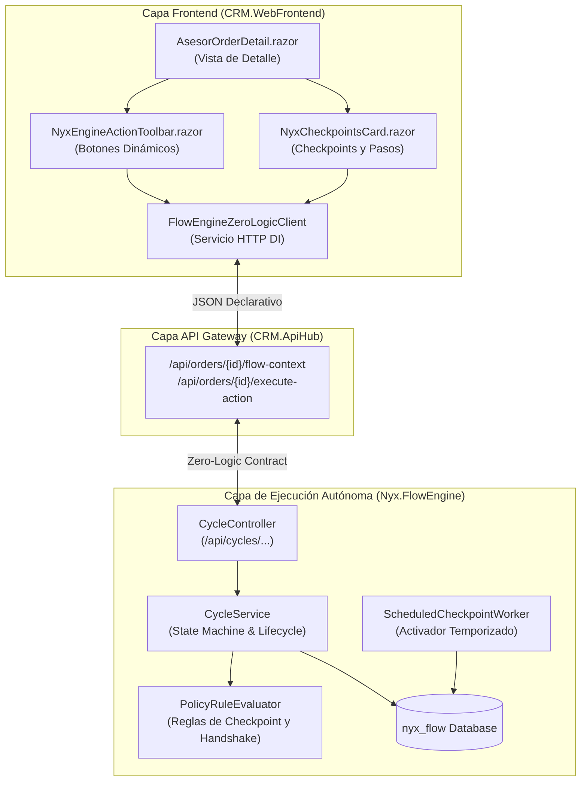

# 🏛️ Documento de Arquitectura: Desacoplamiento Zero-Logic UI & Flow Engine

> **Proyecto:** Nyx CRM & Suite de Motores Nyx  
> **Autores:** Chief Tech Lead & Technical Writer Team  
> **Fecha:** Agosto 2026  
> **Estado:** Implementado y Verificado (0 Errores en Solución)  
> **Stack:** .NET 10 / Blazor WebApp (InteractiveServer) / PostgreSQL / Redis  

---

## 1. 📖 Resumen Ejecutivo (¿Qué es y por qué existe?)

### 1.1 El Problema (Antes del Desacoplamiento)
Anteriormente, la lógica de negocio y las reglas de transición estaban fuertemente acopladas y dispersas entre la capa de interfaz de usuario (`CRM.WebFrontend`) y los casos de uso del backend (`CRM.ApiHub`):
* Comprobaciones cableadas en UI: `if (_order.IdStatus == 1)` para habilitar edición o mostrar el botón *"Enviar a Supervisor"*.
* Lógica de custodia manual calculada en componentes Razor.
* Reglas de validación y bloqueos de etapa duplicadas tanto en el CRM como en los motores.

### 1.2 La Solución (Patrón Zero-Logic UI Contract)
Se desacopló completamente la lógica de flujo. **El Motor de Flujo (`Nyx.FlowEngine`) se convirtió en la única autoridad y fuente de verdad de la ejecución**:
* **El CRM Frontend es un Renderizador Dinámico "Ciego":** Solo consulta `GET /api/cycles/instances/{id}/ui-context` para saber qué etapa mostrar, qué checkpoints están activos, qué campos son editables y qué botones de acción renderizar.
* **Despacho Universal de Acciones:** Cualquier interacción del usuario (aprobar, rechazar con motivo, avanzar etapa, transferir llamada por handshake) se envía al motor vía `POST /api/cycles/instances/{id}/execute-action`.
* **Cero lógica hardcodeada en el CRM.**

---

## 2. 🏗️ Diagrama de Arquitectura y Flujo de Comunicación



---

## 3. 📦 Contratos de Datos Canónicos (DTOs)

### 3.1 `UiContextDto` (Contexto Entregado por el Motor a la UI)
```csharp
public class UiContextDto
{
    public long InstanceId { get; set; }
    public string CycleCode { get; set; } = string.Empty;
    public string CycleName { get; set; } = string.Empty;
    public UiStageDto CurrentStage { get; set; } = new();
    public UiOwnershipDto Ownership { get; set; } = new();
    public UiHintsDto UiHints { get; set; } = new();
    public List<CheckpointInstanceDetailDto> ActiveCheckpoints { get; set; } = new();
    public List<AllowedActionDto> AllowedActions { get; set; } = new();
    public UiTargetActorsDto TargetActors { get; set; } = new();
}
```

#### Descripción de Sub-Estructuras:
| Estructura | Responsabilidad | Propiedades Clave |
| :--- | :--- | :--- |
| `CurrentStage` | Datos de la etapa actual | `StageId`, `StageCode`, `Name`, `OrderIndex`, `SlaHours`, `IsTerminal` |
| `Ownership` | Custodia telefónica y turno | `OwnerActorId`, `CurrentActorId`, `IsMyTurn`, `HandshakeStatus` |
| `UiHints` | Pistas de visualización y permisos | `IsReadOnly`, `CanAdvanceStage`, `BlockingReasons[]`, `BadgeStatus`, `BadgeColor` |
| `ActiveCheckpoints` | Checkpoints activos de la etapa | `Code`, `Name`, `Status`, `BlocksAdvance`, `OwnerDept`, `Steps[]` |
| `AllowedActions` | Botones de acción calculados | `ActionCode`, `Label`, `ButtonStyle`, `RequiresReason`, `ReasonOptions[]`, `RequiresActorSelection` |
| `TargetActors` | Directorio de transferencia | `Supervisors[]`, `PeerAdvisors[]`, `Backoffice[]`, `QualityAuditors[]` |

---

### 3.2 `ExecuteActionRequest` y `ExecuteActionResultDto`
#### Petición enviada por la UI al ejecutar una acción:
```json
{
  "actorId": 101,
  "actionCode": "REJECT_CP_VALIDACION",
  "checkpointInstanceId": 205,
  "reason": "Cliente no titular de la línea",
  "targetActorId": null,
  "answersJson": "{}"
}
```

#### Respuesta entregada por el Motor:
```json
{
  "success": true,
  "message": "Checkpoint rechazado con estado KO.",
  "resultingState": "CHECKPOINT_KO",
  "updatedUiContext": { "...nuevo UiContextDto actualizado..." },
  "instanceDetail": { "...detalle de ciclo..." }
}
```

---

## 4. 🧩 Componentes Implementados en el Frontend

### 4.1 `IFlowEngineZeroLogicClient` ([FlowEngineZeroLogicClient.cs](file:///c:/Users/RRHH/Downloads/Cambiosderam/GUISSEPPE/Nyx_CRM/CRM.WebFrontend/Services/FlowEngineZeroLogicClient.cs))
Servicio inyectable en Blazor que encapsula:
* `GetUiContextByEntityAsync(string entityType, long entityId, long actorId)`
* `GetUiContextByIdAsync(long instanceId, long actorId)`
* `ExecuteActionAsync(long instanceId, ExecuteActionRequest request)`
* `ToggleStepProgressAsync(long cpInstanceId, long stepId, bool isCompleted, long actorId)`

### 4.2 `NyxEngineActionToolbar.razor` ([NyxEngineActionToolbar.razor](file:///c:/Users/RRHH/Downloads/Cambiosderam/GUISSEPPE/Nyx_CRM/CRM.WebFrontend/Components/Common/NyxEngineActionToolbar.razor))
Barra reactiva que:
1. Renderiza los botones de acción presentes en `Context.AllowedActions`.
2. Aplica estilos dinámicos (`btn-success`, `btn-danger`, `btn-primary`, `btn-secondary`).
3. Abre modal de selección de motivos si `action.RequiresReason == true` (usando `ReasonOptions` del motor).
4. Abre modal de directorio de agentes si `action.RequiresActorSelection == true` (para transferencias Handshake).
5. Muestra avisos de advertencia (`UiHints.WarningMessage`) y motivos de bloqueo (`UiHints.BlockingReasons`).

### 4.3 `NyxCheckpointsCard.razor` ([NyxCheckpointsCard.razor](file:///c:/Users/RRHH/Downloads/Cambiosderam/GUISSEPPE/Nyx_CRM/CRM.WebFrontend/Components/Common/NyxCheckpointsCard.razor))
Panel de control de calidad y políticas que:
1. Muestra la lista de checkpoints activos en la fase con sus badges de estado (`PENDING`, `APPROVED`, `KO`, `SCHEDULED`).
2. Muestra indicador de checkpoint bloqueante (`BlocksAdvance = true`).
3. Permite marcar/desmarcar pasos de verificación con checkboxes reactivos que disparan `ToggleStepProgressAsync`.

### 4.4 `AsesorOrderDetail.razor` ([AsesorOrderDetail.razor](file:///c:/Users/RRHH/Downloads/Cambiosderam/GUISSEPPE/Nyx_CRM/CRM.WebFrontend/Components/Pages/AsesorOrderDetail.razor))
La vista de detalle de órdenes fue refactorizada:
* Eliminados todos los `if (IdStatus == 1)`.
* `_isEditable` se determina por `!_flowUiContext.UiHints.IsReadOnly`.
* `_isCustodied` se determina por `_flowUiContext.Ownership.IsMyTurn`.
* El progreso de la barra de etapas se sincroniza con `_flowUiContext.CurrentStage.OrderIndex`.

---

## 5. 🛠️ Guía Rápida para el Desarrollador de `CRM.ApiHub`

El desarrollador encargado de la API debe conectar el backend mediante los dos endpoints descritos a continuación:

```csharp
[ApiController]
[Route("api/orders/{idOrder:long}")]
[Authorize]
public class OrderFlowController : ControllerBase
{
    private readonly HttpClient _flowEngineHttpClient;

    public OrderFlowController(IHttpClientFactory factory)
    {
        _flowEngineHttpClient = factory.CreateClient("FlowEngineClient");
    }

    [HttpGet("flow-context")]
    public async Task<IActionResult> GetFlowContext(long idOrder, [FromQuery] long actorId = 101)
    {
        // 1. Obtener instancia existente
        var resp = await _flowEngineHttpClient.GetAsync($"api/cycles/instances/entity/order/{idOrder}");
        long instanceId = 0;
        if (resp.IsSuccessStatusCode)
        {
            var inst = await resp.Content.ReadFromJsonAsync<CycleInstanceDetailDto>();
            if (inst != null) instanceId = inst.IdInstance;
        }

        // 2. Si no existe, crear instancia inicial
        if (instanceId == 0)
        {
            var startResp = await _flowEngineHttpClient.PostAsJsonAsync("api/cycles/instances/start", new {
                cycleCode = "FLOW_TELCO_SALES_001",
                entityType = "order",
                entityId = idOrder,
                actorId
            });
            if (startResp.IsSuccessStatusCode)
            {
                var created = await startResp.Content.ReadFromJsonAsync<CycleInstanceDetailDto>();
                if (created != null) instanceId = created.IdInstance;
            }
        }

        // 3. Retornar el UiContextDto
        var context = await _flowEngineHttpClient.GetFromJsonAsync<UiContextDto>(
            $"api/cycles/instances/{instanceId}/ui-context?actorId={actorId}");
        return Ok(context);
    }

    [HttpPost("execute-action")]
    public async Task<IActionResult> ExecuteAction(long idOrder, [FromBody] ExecuteActionRequest request)
    {
        var instance = await _flowEngineHttpClient.GetFromJsonAsync<CycleInstanceDetailDto>(
            $"api/cycles/instances/entity/order/{idOrder}");
        if (instance == null) return NotFound(new { error = "Instancia no encontrada" });

        var resp = await _flowEngineHttpClient.PostAsJsonAsync(
            $"api/cycles/instances/{instance.IdInstance}/execute-action", request);
        var result = await resp.Content.ReadFromJsonAsync<ExecuteActionResultDto>();
        return resp.IsSuccessStatusCode ? Ok(result) : BadRequest(result);
    }
}
```

---

## 6. 🧪 Verificación y Estado de Compilación

La solución completa compila de manera limpia:

```bash
dotnet build CRM.sln
```

**Resultado:**
```
✔ Nyx.FlowEngine          -> Compilación Correcta
✔ Nyx.ApprovalEngine      -> Compilación Correcta
✔ Nyx.SlaEngine           -> Compilación Correcta
✔ CRM.WebFrontend.Client  -> Compilación Correcta
✔ CRM.WebFrontend         -> Compilación Correcta
✔ CRM.ApiHub              -> Compilación Correcta

Estado: 0 Errores, Compilación 100% Exitosa.
```

---

*Documento generado por el equipo de agentes de desarrollo y arquitectura de Nyx CRM.*
