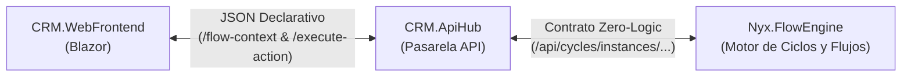

# 📘 INSTRUCTIVO TÉCNICO: INTEGRACIÓN DE APIHUB CON LOS MOTORES NYX (ZERO-LOGIC UI CONTRACT)

> **Documento:** Guía de Implementación para el Desarrollador de `CRM.ApiHub`  
> **Destinatario:** Ingeniero / Desarrollador Backend asignado a la API  
> **Versión:** 2.0 (Arquitectura Desacoplada Zero-Logic)  
> **Estado:** Aprobado por Tech Lead  

---

## 1. 🎯 Objetivo y Principio Rector de la Arquitectura

El CRM (`CRM.WebFrontend` y `CRM.ApiHub`) opera bajo el patrón **Zero-Logic UI Contract**:
* **El Motor de Flujo (`Nyx.FlowEngine`) es la ÚNICA fuente de verdad** para la lógica de negocio, etapas, políticas de bloqueo, custodia telefónica (handshake), disparos por KO y transiciones de estado.
* **El Frontend y el ApiHub NO calculan reglas de negocio:** Únicamente leen el contexto UI (`UiContextDto`) que entrega el motor y despachan las acciones que el usuario ejecute (`ExecuteActionRequest`).



---

## 2. 🔌 Endpoints Requeridos en `CRM.ApiHub`

El desarrollador encargado de `CRM.ApiHub` debe implementar o exponer los siguientes dos endpoints principales dentro del controlador de órdenes o en un controlador dedicado `FlowProxyController`:

### 📍 Endpoint 1: Obtener Contexto de Flujo de una Entidad
* **Método:** `GET`
* **Ruta:** `/api/orders/{idOrder}/flow-context`
* **Query Parameters:** `actorId` (long, ID del usuario en sesión, default: 101)
* **Comportamiento Interno:**
  1. Consultar a `Nyx.FlowEngine` en `GET /api/cycles/instances/entity/order/{idOrder}`.
  2. Si la orden ya tiene una instancia de ciclo activa:
     * Llamar a `Nyx.FlowEngine` en `GET /api/cycles/instances/{idInstance}/ui-context?actorId={actorId}` y retornar el resultado.
  3. Si la orden aún NO tiene una instancia de ciclo:
     * Iniciar la instancia llamando a `POST /api/cycles/instances/start` con el payload:
       ```json
       {
         "cycleCode": "FLOW_TELCO_SALES_001",
         "entityType": "order",
         "entityId": idOrder,
         "actorId": actorId
       }
       ```
     * Invocar `GET /api/cycles/instances/{idInstance}/ui-context?actorId={actorId}` y retornarlo.

#### Ejemplo de Respuesta `200 OK` (`UiContextDto`):
```json
{
  "instanceId": 14,
  "cycleCode": "FLOW_TELCO_SALES_001",
  "cycleName": "Ciclo de Ventas y Provisión Telco",
  "currentStage": {
    "stageId": 102,
    "stageCode": "GESTION_INICIAL",
    "name": "Gestión Inicial del Asesor",
    "orderIndex": 2,
    "slaHours": 24,
    "isTerminal": false
  },
  "ownership": {
    "ownerActorId": 101,
    "currentActorId": 101,
    "isMyTurn": true,
    "handshakeStatus": "NONE",
    "handshakeTargetActorId": null
  },
  "uiHints": {
    "isReadOnly": false,
    "canAdvanceStage": true,
    "blockingReasons": [],
    "badgeStatus": "EN_GESTION",
    "badgeColor": "warning",
    "warningMessage": null
  },
  "activeCheckpoints": [
    {
      "idCpInstance": 205,
      "idInstance": 14,
      "idCheckpoint": 31,
      "code": "CP_VALIDACION_CLIENTE",
      "name": "Validación de Titularidad y DNI",
      "description": "Comprobar coincidencia del titular y DNI",
      "status": "APPROVED",
      "blocksAdvance": true,
      "ownerDept": "Asesor",
      "steps": [
        {
          "idStep": 1,
          "name": "Verificar documento de identidad",
          "isRequired": true,
          "isCompleted": true
        }
      ]
    }
  ],
  "allowedActions": [
    {
      "actionCode": "APPROVE_CP_VALIDACION_CLIENTE",
      "label": "✅ Completar: Validación de Titularidad",
      "buttonStyle": "btn-success",
      "requiresConfirmation": false,
      "requiresReason": false,
      "reasonOptions": [],
      "requiresActorSelection": false,
      "effect": "RESOLVE_APPROVED",
      "checkpointInstanceId": 205
    },
    {
      "actionCode": "ADVANCE_STAGE",
      "label": "🚀 Avanzar a Siguiente Etapa",
      "buttonStyle": "btn-primary",
      "requiresConfirmation": true,
      "requiresReason": false,
      "reasonOptions": [],
      "requiresActorSelection": false,
      "effect": "ADVANCE_STAGE"
    },
    {
      "actionCode": "REQUEST_HANDSHAKE",
      "label": "📞 Transferir Llamada (Handshake)",
      "buttonStyle": "btn-secondary",
      "requiresConfirmation": false,
      "requiresReason": false,
      "requiresActorSelection": true,
      "effect": "HANDSHAKE_TRANSFER"
    }
  ],
  "targetActors": {
    "supervisors": [
      { "actorId": 201, "name": "Carlos Gómez (Supervisor TM)", "role": "Supervisor", "department": "Supervisión", "status": "AVAILABLE" }
    ],
    "peerAdvisors": [
      { "actorId": 102, "name": "Laura Martínez (Asesor)", "role": "Asesor Ventas", "department": "Asesor", "status": "AVAILABLE" }
    ]
  }
}
```

---

### 📍 Endpoint 2: Ejecutar Acción Gobernada por el Motor
* **Método:** `POST`
* **Ruta:** `/api/orders/{idOrder}/execute-action`
* **Cuerpo de la Petición (`ExecuteActionRequest`):**
```json
{
  "actorId": 101,
  "actionCode": "ADVANCE_STAGE",
  "checkpointInstanceId": null,
  "reason": null,
  "targetActorId": null,
  "answersJson": "{}"
}
```
* **Comportamiento Interno:**
  1. Obtener el `idInstance` de la orden (vía consulta a `Nyx.FlowEngine`).
  2. Enviar petición HTTP POST a `Nyx.FlowEngine` en `/api/cycles/instances/{idInstance}/execute-action` con el cuerpo recibido.
  3. `Nyx.FlowEngine` evaluará:
     * Si la acción es `ADVANCE_STAGE`: comprueba que no existan checkpoints bloqueantes pendientes.
     * Si la acción es `APPROVE_<CODE>`: resuelve el checkpoint, evalúa políticas de auto-avance (`AutoAdvanceOnApproval`).
     * Si la acción es `REJECT_<CODE>`: resuelve en KO y evalúa si finaliza el ciclo (`FinalizesCycle`) o si dispara checkpoints encadenados (`disparaSiKoDe`).
     * Si la acción es `REQUEST_HANDSHAKE` / `ACCEPT_HANDSHAKE` / `REVERT_HANDSHAKE`: actualiza la custodia y los permisos de turno.
  4. Si la acción fue exitosa, retornar el `ExecuteActionResultDto` que incluye el nuevo `UpdatedUiContext` para que el frontend refresque la vista en un solo ciclo.

#### Ejemplo de Respuesta `200 OK` (`ExecuteActionResultDto`):
```json
{
  "success": true,
  "message": "Etapa avanzada con éxito.",
  "resultingState": "STAGE_ADVANCED",
  "updatedUiContext": { ... },
  "instanceDetail": { ... }
}
```

---

## 3. 💻 Código de Referencia para `CRM.ApiHub` (C# ASP.NET Core)

A continuación se proporciona la plantilla del controlador para agregar en `CRM.ApiHub/Api/Controllers/`:

```csharp
using Microsoft.AspNetCore.Authorization;
using Microsoft.AspNetCore.Mvc;
using System.Net.Http.Json;
using Nyx.FlowEngine.Domain.Entities;

namespace CRM.ApiHub.Api.Controllers;

[ApiController]
[Route("api/orders/{idOrder:long}")]
[Authorize]
public class OrderFlowController : ControllerBase
{
    private readonly HttpClient _flowEngineHttpClient;
    private readonly ILogger<OrderFlowController> _logger;

    public OrderFlowController(IHttpClientFactory httpClientFactory, ILogger<OrderFlowController> logger)
    {
        // El cliente apunta a FlowEngineBaseUrl (ej: http://localhost:5072 o http://flow_engine_api:5072)
        _flowEngineHttpClient = httpClientFactory.CreateClient("FlowEngineClient");
        _logger = logger;
    }

    [HttpGet("flow-context")]
    public async Task<IActionResult> GetFlowContext(long idOrder, [FromQuery] long actorId = 101)
    {
        try
        {
            // 1. Consultar instancia existente
            var instanceResp = await _flowEngineHttpClient.GetAsync($"api/cycles/instances/entity/order/{idOrder}");
            long instanceId = 0;

            if (instanceResp.IsSuccessStatusCode)
            {
                var instance = await instanceResp.Content.ReadFromJsonAsync<CycleInstanceDetailDto>();
                if (instance != null) instanceId = instance.IdInstance;
            }

            // 2. Si no existe, crear instancia inicial
            if (instanceId == 0)
            {
                var startPayload = new { cycleCode = "FLOW_TELCO_SALES_001", entityType = "order", entityId = idOrder, actorId };
                var startResp = await _flowEngineHttpClient.PostAsJsonAsync("api/cycles/instances/start", startPayload);
                if (startResp.IsSuccessStatusCode)
                {
                    var created = await startResp.Content.ReadFromJsonAsync<CycleInstanceDetailDto>();
                    if (created != null) instanceId = created.IdInstance;
                }
            }

            if (instanceId == 0)
            {
                return StatusCode(502, new { error = "No se pudo obtener ni inicializar la instancia en Nyx.FlowEngine." });
            }

            // 3. Obtener el UiContextDto enriquecido
            var context = await _flowEngineHttpClient.GetFromJsonAsync<UiContextDto>($"api/cycles/instances/{instanceId}/ui-context?actorId={actorId}");
            return Ok(context);
        }
        catch (Exception ex)
        {
            _logger.LogError(ex, "Error al obtener flow-context para la orden #{IdOrder}", idOrder);
            return StatusCode(500, new { error = ex.Message });
        }
    }

    [HttpPost("execute-action")]
    public async Task<IActionResult> ExecuteAction(long idOrder, [FromBody] ExecuteActionRequest request)
    {
        try
        {
            // 1. Obtener la instancia activa de la orden
            var instance = await _flowEngineHttpClient.GetFromJsonAsync<CycleInstanceDetailDto>($"api/cycles/instances/entity/order/{idOrder}");
            if (instance == null)
            {
                return NotFound(new { error = $"No existe instancia de ciclo para la orden #{idOrder}." });
            }

            // 2. Despachar la acción al motor
            var resp = await _flowEngineHttpClient.PostAsJsonAsync($"api/cycles/instances/{instance.IdInstance}/execute-action", request);
            var result = await resp.Content.ReadFromJsonAsync<ExecuteActionResultDto>();

            return resp.IsSuccessStatusCode ? Ok(result) : BadRequest(result);
        }
        catch (Exception ex)
        {
            _logger.LogError(ex, "Error al ejecutar acción {ActionCode} para la orden #{IdOrder}", request.ActionCode, idOrder);
            return StatusCode(500, new { error = ex.Message });
        }
    }
}
```

---

## 4. ✅ Lista de Verificación para el Desarrollador de la API

* [ ] Registrar `HttpClient` con nombre `"FlowEngineClient"` en `Program.cs` de `CRM.ApiHub` apuntando a la URL del motor de flujo (`FlowEngineSettings:BaseUrl`).
* [ ] Incluir los endpoints `GET /api/orders/{idOrder}/flow-context` y `POST /api/orders/{idOrder}/execute-action`.
* [ ] Asegurar que el DTO devuelto sea el tipo canónico `Nyx.FlowEngine.Domain.Entities.UiContextDto`.
* [ ] Probar con Swagger que invocar una acción como `ADVANCE_STAGE` retorne `success: true` y el nuevo `updatedUiContext`.

---

*Fin del instructivo técnico. Para dudas o soporte, contactar al equipo de arquitectura Tech Lead.*
