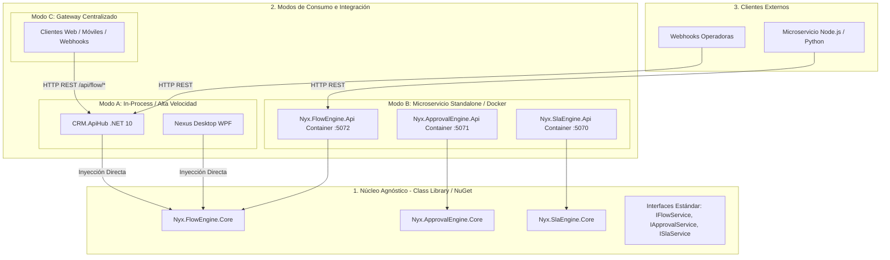

# 🌐 Plan de Arquitectura: Motores Nyx Universales y Reutilizables en Cualquier Sistema

> **Estrategia Multi-Host & Multi-Sistema: Nexus WPF, CRM Web, Microservicios Externos y Terceros**  
> **Motores**: `Nyx.FlowEngine` | `Nyx.ApprovalEngine` | `Nyx.SlaEngine`  
> **Patrón de Diseño**: Domain Core Agnóstico + Dual Adapter (In-Process Directo vs HTTP REST Gateway / Microservice)

---

## 1. 🎯 La Premisa Fundamental: "Write Once, Run Anywhere in the Ecosystem"

La meta principal es que la inversión y robustez desarrollada en los motores de **Nyx CRM** no quede "atrapada" exclusivamente dentro de la aplicación web, sino que funcione como un **estándar corporativo reutilizable** en:

1. **Nexus Desktop (WPF / .NET)**: Módulos de RRHH, Fichas de Empleado, Facturación, Logística.
2. **Nyx CRM (Web Blazor + ApiHub)**: Flujos comerciales, preventa, validación y scoring de ventas.
3. **Microservicios Satélites / Sistemas de Terceros**: Node.js, Python, ERPs legados, Webhooks de operadoras (Vodafone, Securitas).

---

## 2. 🏛️ Arquitectura del Motor Universal (Dual-Host Pattern)

Para lograr máxima velocidad en el CRM sin perder la capacidad de uso externo, separamos los motores en **3 capas bien definidas**:



---

## 3. 🧩 Especificación de los 3 Modos de Uso

### Modo 1: Consumo In-Process (Directo a Base de Datos)
* **Para quién es**: Aplicaciones .NET como `CRM.ApiHub` o `Nexus.WPF`.
* **Cómo se usa**: Se referencia el ensamblado / paquete `Nyx.FlowEngine` y se registra en el contenedor IoC:
  ```csharp
  // En Program.cs de CRM.ApiHub o Nexus WPF:
  builder.Services.AddNyxFlowEngine(builder.Configuration.GetConnectionString("DefaultConnection"));
  builder.Services.AddNyxApprovalEngine(builder.Configuration.GetConnectionString("DefaultConnection"));
  builder.Services.AddNyxSlaEngine(builder.Configuration.GetConnectionString("DefaultConnection"));
  ```
* **Ventajas**:
  - ⚡ **Latencia cero (< 1 ms)** (ejecución directa en memoria).
  - 🛡️ **Transacciones ACID nativas**: El guardado de la ficha/orden y el avance del flujo se pueden ejecutar bajo el mismo `DbTransaction`.
  - 📦 **Cero dependencias de red**: No requiere que otro servicio web esté levantado para funcionar.

---

### Modo 2: Consumo Vía Microservicio Standalone (REST API Independiente)
* **Para quién es**: Sistemas desarrollados en otros lenguajes (Node.js, Python, Java, PHP, Go) o microservicios que residen en servidores separados.
* **Cómo se usa**: Los proyectos `Nyx.FlowEngine`, `Nyx.ApprovalEngine` y `Nyx.SlaEngine` se empaquetan en contenedores Docker y se publican con sus puertos individuales (`:5070`, `:5071`, `:5072`):
  ```bash
  # Levantar solo el motor de flujos como microservicio autónomo:
  docker run -p 5072:5072 nyx-flow-engine:latest
  ```
* **Ventajas**:
  - 🌐 Desacoplamiento de red total.
  - 📈 Escalado elástico horizontal independiente en clusters de Kubernetes o Cloud Run.

---

### Modo 3: Consumo Vía API Central (Unified API Gateway)
* **Para quién es**: Frontend Blazor, Aplicaciones Móviles, Integraciones B2B y Webhooks de proveedores externos.
* **Cómo se usa**: `CRM.ApiHub` expone los endpoints `/api/flow/*`, `/api/approval/*`, `/api/sla/*` actuando como puerta de enlace unificada:
  ```http
  POST /api/flow/instances/start HTTP/1.1
  Host: api.nyxcrm.com
  Authorization: Bearer <JWT_TOKEN>
  Content-Type: application/json

  {
    "flowCode": "PIPELINE_RRHH_ONBOARDING",
    "entityType": "ficha_empleado",
    "entityId": 4028,
    "actorId": 10
  }
  ```
* **Ventajas**:
  - 🔒 Autenticación y autorización centralizada con un único JWT.
  - 📖 Documentación OpenAPI / Swagger unificada en un solo portal (`/swagger`).

---

## 4. 🗃️ Estrategia de Persistencia Multi-Sistema (PostgreSQL Schemas)

Para que cualquier sistema (CRM o Nexus) pueda almacenar datos de motores sin conflictos de nombres, las tablas se organizan en **Esquemas dedicados**:

| Esquema PostgreSQL | Tablas Principales | Propósito |
|---|---|---|
| **`flow.*`** | `flow_definition`, `stage`, `checkpoint_catalog`, `checkpoint_step`, `flow_instance`, `checkpoint_instance`, `checkpoint_instance_step` | Motor de Flujos y Checkpoints |
| **`approval.*`** | `approval_policy`, `approval_chain`, `approval_chain_step`, `approval_request`, `approval_decision`, `approval_delegation` | Motor de Aprobaciones Multinivel |
| **`sla.*`** | `sla_policy`, `sla_measurement`, `sla_holiday`, `sla_audit_log` | Motor de Medición de Tiempos SLA |

> **Flexibilidad**: Si Nexus u otro sistema tiene su propia base de datos PostgreSQL, solo necesita ejecutar el script de inicialización del esquema `flow.*` o `sla.*` y apuntar su ConnectionString allí.

---

## 5. 💻 Ejemplo Concreto: Integración en Nexus WPF

Para integrar el motor de aprobaciones o SLA en **Nexus WPF** (ej. Aprobación de Fichas de Empleado o Contratos de RRHH):

```csharp
// 1. Inyectar en el módulo de Nexus (Nexus.WPF/App.xaml.cs o ServiceLocator):
services.AddNyxApprovalEngine(Configuration.GetConnectionString("NexusDbConnection"));

// 2. Usar en un Servicio de Nexus (ej. FichaService.cs):
public class FichaService
{
    private readonly IApprovalService _approvalService;

    public FichaService(IApprovalService approvalService)
    {
        _approvalService = approvalService;
    }

    public async Task EnviarFichaAAprobacionAsync(long idFicha, long solicitanteId)
    {
        // Dispara la regla en el motor universal
        await _approvalService.SubmitRequestAsync(
            policyCode: "APPROVAL_FICHA_RRHH",
            entityType: "ficha_empleado",
            entityId: idFicha,
            requestedBy: solicitanteId,
            entityContextJson: "{\"departamento\": \"Ventas\"}"
        );
    }
}
```

---

## 6. 🚀 Hoja de Ruta de Implementación

1. **Estandarizar las Interfaces Core**: Unificar `IFlowService`, `IApprovalService`, `ISlaService` con parámetros genéricos (`entityType`, `entityId`).
2. **Generar Extensiones de DI**: Crear `ServiceCollectionExtensions` para registro rápido en 1 línea.
3. **Mantener Dockerfiles Standalone**: Garantizar que los Dockerfiles de `Nyx.FlowEngine`, `Nyx.ApprovalEngine`, `Nyx.SlaEngine` sigan disponibles para despliegues independientes en Docker.
4. **Validación Multi-Host**: Probar la ejecución tanto dentro de `CRM.ApiHub` como de forma aislada en consola/WPF.

---

> 📄 **Documento de Arquitectura**: Nyx Universal Reusable Engines  
> ✍️ **Autor**: Tech Lead Agent / Antigravity AI  
> 🏷️ **Versión**: v2.2.0-MULTI-HOST-READY  
