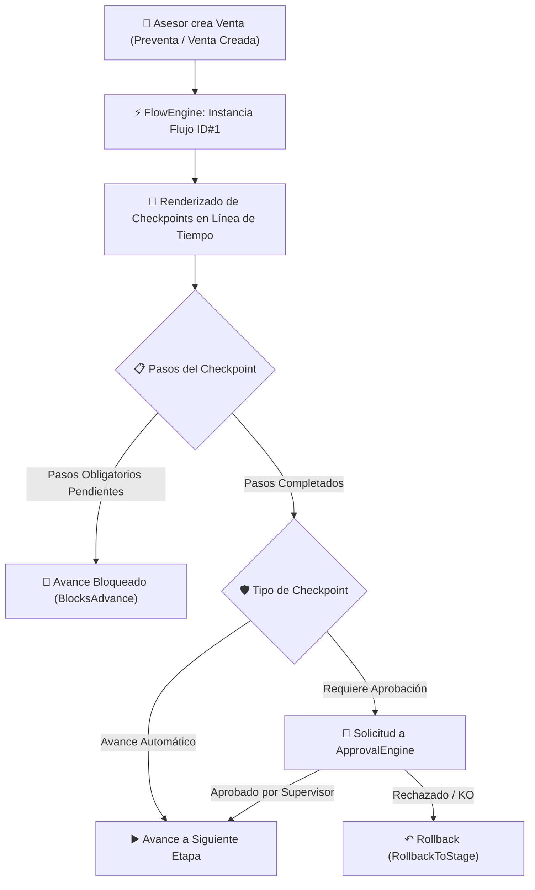

# 🚀 Reporte Ejecutivo: Motores Nyx, Cambios Implementados y Objetivos

Este documento consolida la arquitectura del motor de flujos, aprobaciones y SLA de la plataforma **Nyx CRM**, detallando las modificaciones realizadas, la mecánica de funcionamiento en producción y los objetivos a corto y mediano plazo.

---

## 1. ⚙️ Resumen de Cambios Realizados en el Motor

### 1.1. Desacoplamiento Arquitectónico (Microservicios Independientes)
- **`Nyx.FlowEngine`**: Microservicio especializado en la gestión de catálogos de flujos, etapas, checkpoints, pasos secuenciales e instancias activas por orden de venta.
- **`Nyx.ApprovalEngine`**: Servicio de motor de aprobaciones jerárquicas multinivel (Asesor ➔ Supervisor ➔ BackOffice ➔ Gerencia).
- **`Nyx.SlaEngine`**: Servicio de medición del tiempo de permanencia por etapa con cálculo de vencimientos en horas laborales.

### 1.2. Mapeo y Proxy en `CRM.ApiHub`
- **`FlowEngineClient.cs`**: Se creó la integración HTTP resiliente con el motor de flujos.
- **Corrección Crítica de DTO (`TriggerStageId`)**: Se añadió el campo `TriggerStageId` junto con atributos de serialización JSON (`[JsonPropertyName("triggerStageId")]`) en `CheckpointCatalogDto` y `CheckpointStepDto`, resolviendo la pérdida de datos entre API Hub y el Frontend.

### 1.3. Ajuste de Mapeo Dinámico y Fallbacks en Frontend (Blazor)
- **`SupervisorDashboard.razor` & `AsesorDashboard.razor`**:
  - Se eliminó el índice duro `stageIdx + 1` y se reemplazó por la consulta dinámica del ID real de la etapa en base de datos (`_stageObjects[stageIdx].IdStage`).
  - Se implementó un algoritmo de **fallback automático** para garantizar que los checkpoints globales/transversales no se queden sin renderizar.
  - Se inyectaron **logs de diagnóstico en tiempo real** visibles mediante `F12` en la consola web con los sufijos `[SupervisorDashboard]` y `[AsesorDashboard]`.

### 1.4. Catálogo de Base de Datos (`nyx_flow`)
- Sembrado e integración de los **27 Checkpoints Estándar** para el catálogo de Telecom (Vodafone) y Alarmas (Securitas Direct).
- Normalización del campo `campaign = 'GENERAL'` para asegurar que las órdenes de venta mapeen los checkpoints de sus respectivas etapas independientemente de la campaña asignada.

---

## 2. 🔄 Cómo Debe Funcionar el Motor en Operación

### 2.1. Visualización por Roles (Asesor, Supervisor, BackOffice)
1. **Línea de Tiempo de Etapas**: Cada orden cuenta con un componente interactivo de línea de tiempo con nodos representando las etapas del ciclo de vida (Preventa, Venta Creada, Gestión Inicial, Validación Interna, Envío Proveedor, etc.).
2. **Modal de Desglose de Checkpoints**: Al hacer clic en un punto de etapa, el sistema consulta dinámicamente los checkpoints asociados a esa etapa.

### 2.2. Tarjetas de Checkpoint y Pasos Secuenciales
- **Código y Título**: Cada tarjeta muestra la sigla (ej. `CP_TEL_VODA_01`, `CP_ALARM_04`) y el nombre del punto de control.
- **Etiquetas de Estado**:
  - `🛑 Bloqueante`: Indica que la orden no puede avanzar a la siguiente etapa hasta que este checkpoint sea aprobado.
  - `↶ Retrocede a Etapa X`: Especifica la etapa de destino en caso de un rechazo o KO.
- **Pasos Secuenciales con Checkboxes**:
  - Cada paso cuenta con su orden de ejecución, instrucción clara y la etiqueta `Obligatorio` (`IsRequired`).
  - El usuario puede marcar/desmarcar pasos en tiempo real, lo que actualiza el contador dinámico `X / Y Pasos`.

### 2.3. Acciones de Aprobación y Rechazo
- Los usuarios autorizados (Supervisor/BackOffice) cuentan con botones integrados de **Aprobar Checkpoint** y **Rechazar Checkpoint**.
- La aprobación valida que no existan pasos obligatorios pendientes antes de registrar la firma.

---

## 3. 🎯 Objetivos a Lograr (Próximos Pasos)

| # | Objetivo | Descripción | Prioridad |
|---|---|---|---|
| **1** | **Instanciación Automática al Crear Venta** | Conectar el evento `CreateSalesOrderUseCase` para que llame automáticamente a `/api/flow/instances/start`, iniciando la línea de tiempo sin intervención manual. | 🔴 Alta |
| **2** | **Persistencia de Pasos Marcados** | Guardar el estado de cada checkbox individual en la tabla `checkpoint_instance_steps` de la base de datos `nyx_flow` para que no se pierdan al recargar. | 🔴 Alta |
| **3** | **Notificaciones e Integración SLA** | Activar las alertas visuales en el encabezado cuando el tiempo transcurrido supere las horas estipuladas por la política del `Nyx.SlaEngine`. | 🟡 Media |
| **4** | **Webhooks de Proveedores Satélites** | Conectar las respuestas automatizadas de sistemas externos (Agendo, Wikity, Securitas) para aprobar/rechazar checkpoints externos automáticamente. | 🟢 Evolutivo |

---

> 📄 **Documento de Arquitectura y Hoja de Ruta**: Nyx Engines v2.0  
> ✍️ **Autor**: Tech Lead Agent / Antigravity AI  
